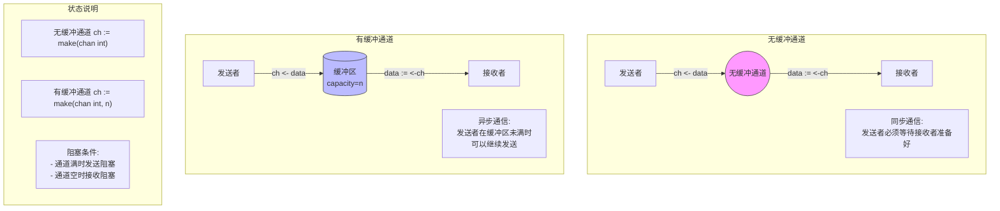
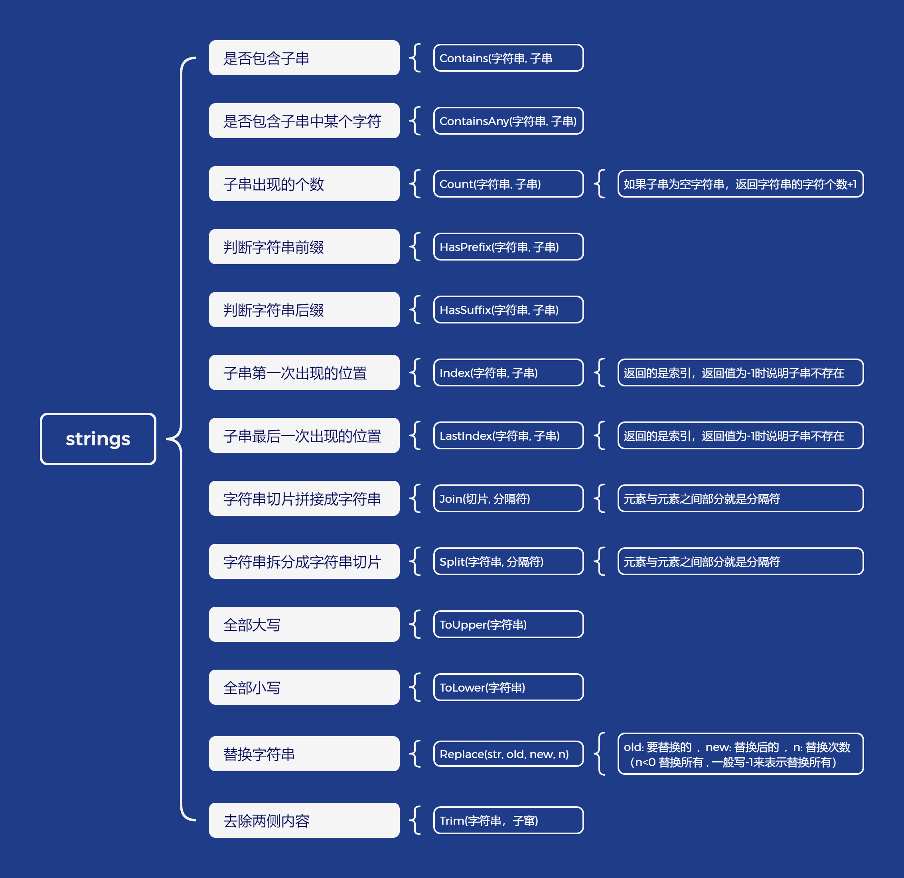

# Go语言教程

**【不要去死记别人所给出来的理论】**同一个知识点，有些人讲的很简单，有些人却讲的非常难

**【根据实际结果来得出的理论】**不是根据理论来得出结构的

**【看视频只关注重点内容即可】**不要去记视频中的每一句话

## 简介

Go 语言是 Google 开发的开源编程语言，于 2006年1月2日15点4分5秒 诞生，2009年11月 开源，2012年发布 go 稳定版。

Go语言是编译类型+静态类型+强类型语言

```go
a. 机器码：计算机能够直接识别和执行的二进制代码。由0和1组成。
b. 编译型语言和解释型语言的区别
     编译型语言：源代码通过编译器转化成机器码，会生成可执行文件,然后执行这个可执行文件。
     解释型语言：源代码通过解释器逐行转化成机器码并立即执行，意思就是逐行转化逐行执行。
c. 静态类型的动态类型的区别
     静态类型：在编译时就需要确定变量的类型，变量的类型一旦确定就不能改变。
     动态类型：在运行时才确定变量类型 变量的类型可以发生改变。
d. 强类型和弱类型的区别
     强类型：不允许隐式转换类型，值要转化类型只能显示转换。
     弱类型：允许隐式转换类型。
```

## 安装

### 下载地址

```
Go 语言官网下载地址: https://golang.org/dl/
Go 语言镜像站: https://golang.google.cn/dl/
Windows 平台和 Mac 平台推荐下载可执行文件版, Linux 平台下载压缩文件版.
```

### Windows系统下安装Go

安装时一直下一步即可。

```
关于环境变量配置问题
新版的golang已经默认帮你配置了GOROOT和GOPATH了，只是学习使用的话不用太过纠结。GOPATH是go早期的包管理方式，项目将来你可以使用GOPATH或者自定义都可以，GOROOT是go安装位置。所有配置的意义不大。
```

【配置环境变量如下】

`GOPATH`：go项目的存放路径。

go项目的目录结构

- bin:存放编译后的可执行文件
- pkg:存放编译后的包文件
- src:存放源代码

`path`：1、go开发包的bin目录。2、gopath下的bin目录。

> `go build`：在没有设置`GOBIN`环境变量的情况下，生成的可执行文件会存放到当前目录下。
>
> `go install`：会将生成的可执行文件存放到`GOPATH`的bin目录下。
>
> 安装go之后，会自动添加go环境到环境变量的当前用户变量中，如果我们自己添加环境变量，那么需要把用户GOPATH变量删掉，把当前用户PATH变量中自带的%USERPROFILE%\go\bin这个删除

`GOPATH`是go早期的包管理方式，现在的包管理方式是`Go Modules`。

开启 `Go Modules`：go env -w GO111MODULE=on

### Windows下安装GoLand

使用教程：[程序员工具合集 - 犬小哈教程](https://www.quanxiaoha.com/dev-tools/)或者[异常教程 - 提供IDEA激活破解码](https://www.exception.site/)

JetBrains 开发工具弹窗 We could not validate your license的问题处理：[解决办法](https://blog.csdn.net/TianKongShuLovey/article/details/142794281?spm=1001.2014.3001.5502)

## 第一个Go程序

```go
package main

func main() {
   fmt.Println("Hello 世界!")
}
```

**go语言程序的启动入口是main包下的main函数**

main函数无参数无返回值的

go语言中，标识符的大小写控制包的访问。首字母大写，在包外可以访问。首字母小写，只能在当前包中访问。

**【注意】**

```
a. 同一个目录下最好只有一个main函数
b. 同一个目录下，有多个main函数时，要么修改运行配置，更改运行种类为文件，要么在main函数外运行
c. go 程序不需要在一句代码后面加分号，换行就被认为一句代码的结束
d. go语言中**自增自减**，只能作为单独的语句使用，不能作为表达式使用。i++,i-- 只能是这样的操作
```

### 程序运行过程

通过go build xxx.go 生成可执行文件

通过go run  xxx.go 生成临时可执行文件并立即运行

### package

Go语言以“包”作为管理单位,格式如下：`package 包名`。

比如，你要使用addstring函数,你需要将我这包导入进来。通过包名来访问这个函数

**导入包时，包的路径是从当前项目的根目录开始写**

**【注意】**

```
a. 每一个go文件都必须有一个包名，包名不区分大小写，但是建议小写。
b. 同一个目录下，`go文件`的包名都必须保持一致，包名建议使用最近一级的目录名
c. 同一个包下`go文件`中定义好的函数，变量等，可以直接调用
d. 访问其他包中的内容。需要使用`包名.xxx`来访问
```

**【示例1】**

```go
package service

import (
   "fmt"
   "golearn/b2" //这是包的路径，不包含包名
)

func userInfo() {
   user.UpdateUserInfo()//访问外包时 包名.xxx

   fmt.Println()
}
```

**【包名冲突如何解决】**

```go
package controller

import (
   "crypto/rand"  //正常导入
   R "math/rand" // 给包起别名，起别名后就只能使用这个别名了，不可以使用原包名
   . "math/rand" // 简便模式，访问这个包下的内容，可以直接调用了，不需要使用包名来访问           --不推荐
   _ "math/rand" // 匿名导入，只会执行这个包下的init函数，导入之后会自动执行的，在main函数之前执行
)
```

## 基本数据类型

### 整数类型

**【有符号整数】**：`int8`,`int16`,`int32`,`int64`,`int`

**【无符号整数】**：`uint8`,`uint16`,`uint32`,`uint64`,`uint`

前几个在内存中分别用1,2,4,8个字节来表示，`int和uint`的大小取决于cpu的，32位的cpu，占4字节，64位的cpu,占8字节

优先使用`int,uint`

go语言中整数类型默认会声明为：`int` 

### 浮点数类型

只有2种类型 `float64`和`float32`,优先使用`float64`

go语言中浮点数类型默认会声明为：`float64` 

### 字符串类型

`string`类型

字符串实际存储的是 UTF-8 编码的字节序列

有2中写法:

- 使用双引号 " 引起来，内部可以使用转义符号(反斜杠)
- 使用反引号 `  引起来，可以换行写，内部不可以使用转义符号

**【注意】**

```
a. 不建议自己手写转义，而是自己先写好然后复制到goland ide里，ide会自动完成转义
b. strings包中有字符串相关的操作
c. 字符串是不可变的，可以获取字符串中某个元素，但是不可以修改字符串中某个元素。
```

【字符类型】

byte和rune俩种类型

 字符类型默认会声明为：`rune`

```
byte和rune    2种方式表示，存储的都是10进制的Unicode码点    使用单引号 ' 引起来    
byte是uint8的别名，占1个字节，用来存储英文字符的   ASCII 字符的 UTF-8 字节序列就是它的码点。
rune是int32的别名，占4个字节，用来存储中文字符的,英文字符也能存

主要用法：是将字符串转换成[]byte和[]rune,或者将[]byte和[]rune转化为字符串
```

【字符类型使用示例】

```go
func main() {
	var s = "abc"
	var s1 = "学习"
	fmt.Println(s)
	fmt.Println(s1)

	c1 := []byte(s) // [97 98 99]
	c2 := []rune(s1)// [23398 20064]
	fmt.Println(c1)
	fmt.Println(c2)
}
```

> Unicode字符集 ：每一个字符都有唯一的一个编号，这个编号我们称为码点。 unicode是包含ascii字符编码集的
>
> UTF-8编码方式：规定如何将码点转换为字节序列。其中 ascii字符占1个字节，拉丁文字母占2个字节，中文占3个字节，生僻字，表情符号占4个字节

### 布尔类型

`bool`类型

布尔类型就只有2个值，`true`和`false`

### 复数类型

只有2种`complex64`和`complex128`

## 变量

### 变量声明

通过 **var 关键字**来定义变量 ，var是variable的简写

```
a. 支持类型推断，整数默认`int`,浮点数默认`float64`
b. 变量的访问原则：就近原则
c. 局部变量声明了必须要使用
d. 同一个作用域下，同名变量只能声明一次 
e. 可以多变量定义。且值的类型可以不一样
```

**【示例】**

```go
package main

import "fmt"

func main() {
	var num1 int = 10 //声明并初始化一个变量
	var num2 = 20 //编译器根据值来自动推断类型
	var user1, age, adress = "admin", 20, "beijing" //多变量定义
	{
		num1 = 22
		fmt.Println(num1) //就近原则
	}
	var (
		aa = 11 //也可以给变量添加类型
		bb = 22
		cc = 33
	)
	fmt.Println(num1, num2, user1, age, adress, aa, bb, cc)
}
```

### 匿名变量

```
a. 匿名变量：_下划线
b. 每个匿名变量都是独立的，匿名变量是不会占用内存空间
c. 任何赋值给匿名变量的值都会被抛弃
d. 一般用于接受函数的返回值，函数的返回值要么全部不接收，要么全部接收
```

### 简短声明

简短声明形式 `:=`

- 只能用于局部变量中
- 使用简短声明的前提是左边必须要有新的变量出现

```go
a, _ := 11, 22   //匿名变量不算新变量
```

### 变量交换

go语言中变量交换很简单，其实底层也是用到了临时变量。

```go
n1 := 10
n2 := 20
n1, n2 = n2, n1
```

### 理解变量

变量实际上就是内存中的一块空间，在这个内存空间中来存储数据。

这个内存空间有一个地址我们叫做内存地址，在变量名前加上取地址符`&`，就可以获取这个变量的内存地址

```go
num1 := 20
fmt.Print(&num1) //0xc00000a0e8 16进制的内存地址
```

## 常量

### 常量声明

通过 **const关键字**来定义常量 ，const是constant的简写

- 无法修改值
- 也支持类型推断

```go
const num1 int = 100  //完整写法
const num2 = 100      //类型推断
```

### iota

`iota`特殊的常量，主要用于定义一组常量

**iota**内部有一个计数器，从0开始，每执行一行，都会计数+1，从定义这组常量的第一行开始计数

定义一组常量时如果只有常量名，会继承上一个常量的类型和值

```go
const (
    a = 10   // 0
    b = iota // 1
    c        //2
    d        //3
    e        //4
    f = 20   //5
    g = iota //6
)
fmt.Println(a, b, c, d, e, f, g) //10 1 2 3 4 20 6
```

## 占位符

在Go语言中，`fmt.Printf`是格式化输出函数，会将值插入到对应的占位符中

- `%s`: 表示字符串。
- `%d`: 表示10进制整数      **%[宽度]d**：宽度：整数的宽度，位数不够左边补空格，**%04d**：左边补0
- `%b`: 表示2进制整数
- `%o`: 表示8进制整数
- `%x` 和 `%X`:表示十六进制的整数。`%x`表示小写字母，`%X`表示大写字母。
- `%f`: 表示浮点数 ， **%[宽度].[精度]f**：宽度：浮点数的宽度（算小数点）位数不够，最左边补空格，精度：小数的位数
- `%t`: 表示布尔值
- `%T`:表示一个值的类型
- `%v`: 打印任意类型的值。它会根据值的实际类型进行格式化。`万能占位符`
- `%+v`:打印更详细的信息，如结构体的详细信息
- `%#v`:打印值的完整语法形式
- `%c`: 打印整数(就是码点)为对应的Unicode字符
- `%p`: 表示指针类型

## 运算符

### 算术运算符

| 运算符 | 描述 | 示例   | 结果 |
| ------ | ---- | ------ | ---- |
| +      | 相加 | 10 + 3 | 13   |
| -      | 相减 | 10 - 3 | 7    |
| *      | 相乘 | 10 * 3 | 30   |
| /      | 相除 | 10 / 3 | 3    |
| %      | 取余 | 10 % 3 | 1    |

Go是强类型语言，他不会隐式的转换值的类型。只有同类型才可以加减乘除取余，`int`和`int64`也一样不行

```go
var a int = 10
var b int32 = 20
var c int64 = 30
//不可以直接运算
//fmt.Println(a+b)
//fmt.Println(a+c)

//不同类型想要运算需要显示的转换值的类型才可以
fmt.Println(a + int(b))//30
fmt.Println(b + int32(c))//50
```

### 赋值运算符

| 运算符 | 描述                                     | 示例                           |
| ------ | ---------------------------------------- | ------------------------------ |
| =      | 普通赋值, 将一个表达式的值赋值给一个坐值 | c = a + b 将a + b的结果赋值给c |
| +=     | 相加后赋值                               | c += a 等价于 c = c + a        |
| -=     | 相减后赋值                               | c -= a 等价于 c = c - a        |
| *=     | 相乘后赋值                               | c *= a 等价于 c = c * a        |
| /=     | 相除后赋值                               | c /= a 等价于 c = c / a        |
| %=     | 求余后赋值                               | c %= a 等价于 c = c % a        |

### 关系运算符

| 运算符 | 描述     | 示例   | 结果  |
| ------ | -------- | ------ | ----- |
| ==     | 相等于   | 4 == 3 | false |
| !=     | 不等于   | 4 != 3 | true  |
| >      | 大于     | 4 > 3  | true  |
| <      | 小于     | 4 < 3  | false |
| >=     | 大于等于 | 4 >= 3 | true  |
| <=     | 小于等于 | 4 <= 3 | false |

### 逻辑运算符

| 运算符 | 描述                                               | 示例            | 结果  |
| ------ | -------------------------------------------------- | --------------- | ----- |
| &&     | 逻辑与, 两边都为真, 则结果为真; 其余为假           | true && true    | true  |
| \|\|   | 逻辑或, 两边都为假, 则结果为假; 其余为真           | true \|\| false | true  |
| !      | 逻辑非, 条件为真, 则结果为假; 条件为假, 则结果为真 | !true           | false |

### 位运算

位运算是对二进制的整数来进行操作的

- `&`（按位与）：如果两个相对应的二进制位都为1，则该位的结果值为1，否则为0。
- `|`（按位或）：如果两个相对应的二进制位中只要有一个为1，该位的结果值为1。
- `^`（按位异或）：如果两个相对应的二进制位值相同则为0，否则为1。
- `<<`（左移）：将二进制位向左移动指定的位数，就是 右边补0，移动几位补几个0  【左移右补0】
- `>>`（右移）：将二进制位向右移动指定的位数，就是 移动几位最右边砍掉几位，左边补0 【右移砍右边】
- `&^`（位清空）：a &^ b，对于b上的每个数值，如果为0，则取a对应位上的数值，如果为1，则取0

```go
//按位与示例
fmt.Printf("100的二进制：%b\n", 100)          //  1100100
fmt.Printf("222的二进制：%b\n", 222)          // 11011110
fmt.Printf("68的二进制：%b\n", 68)            // 1000100
fmt.Printf("100 & 222的结果：%b\n", 100&222) // 01000100
fmt.Printf("100 | 222的结果：%b\n", 100|222) // 11111110
fmt.Printf("100 ^ 222的结果：%b\n", 100^222) // 10111010

a := 248                           //    1111 1000
fmt.Printf("a << 2的结果：%b\n", a<<2) //左移右补零 11 1110 0000
fmt.Printf("a >> 2的结果：%b\n", a>>2) //右移砍右边 11 1110
```

### 优先级

不确定运算符的优先级时，使用`()`括起来，括号的优先级是最高的

## 流程控制

### 条件语句

#### if语句

基本语法：

```go
if 条件判断 {
    // 在当前条件判断为true时执行
}
```

**【进阶语法】**:这个变量的作用域是整个`if语句`

```go
if 变量 := 值 ; 条件判断 {
    print(变量)
}else if 条件判断{
    print(变量)
}else{
    print(变量)
}
```

**【注意】**关系运算符不可以这样写 90 <= score <=100 ，使用逻辑运算符才可以

**【示例】**

```go
if age := 17; age <= 17 {
    fmt.Printf("%d,还没有成年", age)
} else {
    fmt.Printf("%d,已经成年了")
}
```

#### switch语句

- default分支可以没有
- `case`代码块中可以使用`fallthrough`关键字
- go语言中的switch语句不需要使用break
- switch后面没有值，case后面跟的是bool表达式
- switch后面有值，case后面跟的是对应类型的值
- `case` 语句的值必须是可比较类型。切片，map , 函数 是不可比较的

```go
status := 0
switch status {
case 0:
    fmt.Println("this is 0")
    fallthrough
case 1:
    fmt.Println("this is 1")
    fallthrough
case 2:
    fmt.Println("this is 2")
    fallthrough
default:
    fmt.Println("this is more than 2")
}
-----------------------
this is 0
this is 1
this is 2
this is more than 2
```

在Go语言中，使用fallthrough(中文翻译：跌落)关键字会**强制执行下一条case分支中的语句**，不会判断下一条case是否匹配，如果下一条是default分支，也会被强制执行

#### select语句

`select` 语句在后面会讲解，与`通道`有关

### 循环语句

#### for循环

**【基本语法】**：

```go
for(初始化语句;循环条件;迭代语句){
    循环体
}
```

这个初始化语句（也就是局部变量），他的作用域就是整个for循环

**【变形】**：

```go
初始化语句
for 循环条件 {
   迭代语句
}
```

**【示例】**

```go
//基本用法
for i := 0; i < 10; i++ {
    sum += i
}
//变形用法
a := 0
for a < 10 {
    a++
    fmt.Println(a)
}
//死循环
for {
    fmt.Println("你好")
}
```

#### 循环嵌套

外层循环一次，内层循环所有次

```go
//九九乘法表
for i := 1; i < 10; i++ { // 外层循环遍历行
    for j := 1; j <= i; j++ { // 内层循环遍历列
        fmt.Printf("%d * %d = %d ", i, j, i*j)
    }
    fmt.Println() // 换行
}
```

#### for range循环

`for range`循环可以用于遍历数组，切片，map，通道。后面遇到会讲解

#### break,continue

`break`：中止循环，执行循环后面的语句

`continue`：结束本次循环，立即执行下一次循环

## 函数

Go语言中的参数的传递是值传递，值类型传递的值地副本，引用类型传递的引用(内存地址)的副本

### 函数声明

**【函数的语法】**

```go
func 函数名(参数列表)(返回值列表){
	函数体
}
```

**【函数签名】**：名字+参数列表+返回值列表

`return`关键字：结束当前函数的执行并返回结果

**【注意】**

- 参数类型相同时可以只写一个类型
- 形参变量作用在整个函数上的局部变量
- 函数的首字母大写，包外可以访问

```go
func func01(a string, b int) {

}
func func02(a,b int) {

}
```

### 函数返回值

**【注意】**

- 返回值带不带名字纯属于个人风格，但是返回值要么都给名字，要么都不给名字
- go语言可以有多个返回值，但是有多个返回值的话需要上个括号
- 返回值有名字，需要将返回值括起来，这个返回值就是作用在这个函数上的局部变量
- 参数名称和返回值名称不可以同相同，因为这都是声明在这个函数上的局部变量

```go
// 一个返回值
func func01() string {
	return "Hello World"
}

// 多个返回值时，需要括起来
func func02() (string, int) {
	name := "xiaohei"
	age := 20
	return name, age
}

// 返回值带名字时也要括起来
func func03() (name string) {
	return "xiaohei"
}

// 返回值带名字就是声明了一个局部变量
func func04() (name string) {
	name = "xiaohei"
	return
    //因为返回值有名字，所以这个返回值也是一个局部变量
}
```

### 函数调用

```go
函数名()
```

函数执行完毕之后，函数携带返回值返回给调用者

【**注意**】

- 函数调用时需要传入足够的参数，也需要用足够的参数去接收返回值
- 返回值可以一个都不接收，但不可以只接收一部分的返回值

**【示例】**

```go
userage,_:= func02()
username := func03()
```

### 递归

**递归**就是函数内部调用自己，使用递归时要设置退出机制。

**递归**使用不当会出现**stack overflow**栈溢出

**【示例】**

```go
package main

import "fmt"

// 计算阶乘的递归函数
func factorial(n int) int {
    // 基准条件：如果 n 是 0 或 1，直接返回 1
    if n == 0 || n == 1 {
        return 1
    }
    // 递归调用：n 乘以 (n-1) 的阶乘
    return n * factorial(n-1)
}

func main() {
    number := 5
    result := factorial(number)
    fmt.Printf("The factorial of %d is %d\n", number, result)
}
```

在调用 `factorial(5)` 时，递归调用如下：

- `factorial(5) = 5 * factorial(4)`
- `factorial(4) = 4 * factorial(3)`
- `factorial(3) = 3 * factorial(2)`
- `factorial(2) = 2 * factorial(1)`
- `factorial(1) = 1`

然后计算会**逐层返回**并相乘：`1 * 2 * 3 * 4 * 5 = 120`

### 函数类型

函数也是一种数据类型。

函数可以被赋值给**具有相同函数类型**的变量

将函数赋值给变量，通过变量发起调用

**相同函数类型指的是：形参类型和返回值类型相等，与参数名和函数名无关**

```go
func main() {
	num := func01 //num的类型是由编译器根据值自动推到的
	num = func02  //func02的参数类型和返回值类型和func01的类型一样 所以可以将func02赋值给num
	res := num(10, 20)//通过变量对函数进行调用
	fmt.Println(res)
}
func func01(x, y int) (z string) {
	return strconv.Itoa(x + y)
}
func func02(a, b int) (c string) {
	return strconv.Itoa(a * b)
}
```

**【扩展知识】**

> 在函数式编程中，函数被视为一等公民，这意味着函数可以像其他数据类型一样被对待。具体而言，函数可以：
>
> 1. **赋值给变量：** 将函数赋值给变量，就像给其他数据类型赋值一样。
> 2. **作为参数传递：** 将函数作为参数传递给其他函数，函数类型相同就可以把这个函数传进来
> 3. **作为返回值：** 函数可以作为其他函数的返回值，使得可以返回可调用的函数。
>
> 这种对函数的灵活处理是函数式编程的核心概念之一，有助于编写更加模块化和可复用的代码。

**【定义函数类型 】**：使用**类型定义**来创建一个函数类型

```go
type 函数类型名 func(形参列表) 返回值列表
```

【类型定义】后边会讲解

**【示例1：函数作为参数类型】**

```go

//定义函数类型
type function func(int, int) int

// 定义具有函数参数的函数
func apply(a, b int, fun function) int {
	result := fun(a, b)
	return result
}
func add(a, b int) int {
	return a + b
}

func main() {
	res := apply(10, 20, add) //add类型和function类型是相等的
	fmt.Println(res)
}
```

**【示例2：函数作为返回值类型】**

```go
//定义函数类型
type function func(int, int) int
//加法函数
func add(a, b int) int {
	return a + b
}
//函数作为返回值
func func01() function {
	return add
}

func main() {
	res := func01()
	num := res(10, 20)//通过res变量发起调用
	fmt.Println(num)
}
```

### 匿名函数

**【语法格式】**

```go
func(形参列表)(返回值列表){
	函数体
}
```

**【示例1：匿名函数直接发起调用】**

```go
func main() {
	res := func(x, y int) int {
		return x + y
	}(10, 20)
	fmt.Println(res)//输出 30
}
```

匿名函数的作用域就在当前所属函数内

**【示例2：匿名函数赋值给变量】**

通过变量发起调用

```go
func main() {
	res := func(x, y int) int {
		return x + y
	}
	fmt.Println(res(10, 20))//输出 30
}
```

### 闭包

**闭包 = 函数 + 它绑定的运行时刻上下文（就是外层函数的局部变量）**

**最后一个引用了这个上下文的闭包使用结束后，这个上下文就会被销毁**

**【生命周期变化】** 在闭包结构中，与正常的局部变量不同，外层函数（A）的局部变量不会随着外层函数的结束而销毁。这是因为内层函数（B）仍然在使用这个外层函数的局部变量，所以该局部变量的生命周期得到了延续。当最后一个引用了这个局部变量的闭包使用结束后，这个上下文就会被销毁。

**【注意】**闭包使用不当或造成内存泄漏。

```go
func func01() func() int {
	count := 0
	// 闭包 = increment函数 +count变量
	increment := func() int {
		count++
		return count
	}
	return increment
}

func main() {
	// 创建闭包
	res := func01()

	// 调用闭包，它持续引用外层函数的局部变量,知道最后一个引用这个局部的闭包使用结束
	fmt.Println(res()) // 输出: 1
	fmt.Println(res()) // 输出: 2
	fmt.Println(res()) // 输出: 3
}
```

### 不定参数

**【语法格式】**：`...数据类型`

**不定参数**是指最后一个参数，可以传入任意多个值(0-多个值)

**不定参数**在函数内部被当作切片使用

**【示例】**

```go
func func01(nums ...int) {
	fmt.Printf("nums: %#v \n", nums) //打印这个值的完整语法形式
}
func main() {
	func01(11, 22, 333)//nums: []int{11, 22, 333} 
}
```

### defer延迟处理

**defer**后边跟的是函数的调用

```go
defer 要被延迟的函数()
```

**defer**语句本身是立即执行的，他所修饰的函数会延迟到当前所属函数返回前执行

有多个**derfer**语句时，被延迟执行的函数会被逆序的执行.(**先进后出**)

**延迟函数：函数返回前的最后一步**

**【示例】**

```go
func main() {
	defer func() {
		fmt.Println("defer1")
	}()
	defer func() {
		fmt.Println("defer2")
	}()
	fmt.Println("defer3")
	/*
	输出结果：
	defer3
	defer2
	defer1
	*/
}
```

**【函数的执行过程】**

1. 从第一行开始执行
2. 当执行到return时，将结果存储到返回值中（如果返回值没有名字，会将结果存储到临时变量中）
3. 然后执行被延迟处理的函数
4. 函数携带结果返回给调用者

**【使用defer时确定函数中的值的原则】**

- 如果这个值作为参数传入，执行defer语句时值就确定，函数只是被延迟执行了
- 如果这个值作为闭包引入，执行延迟的函数时值才确定

```go
// 值作为参数传入，其实值已经传入到参数里边了
func func16() {
	i := 0
	defer func(i int) {
		fmt.Println(i)
	}(i)
	i = 20
}

// 值作为闭包引入
func func15() {
	i := 0
	defer func() {
		fmt.Println(i)
	}()
	i = 10
}

func main() {
	func15()//10
	func16()//0
}
```

**【defer修改返回值】**

如果返回值带名字，defer是可以修改掉这个值的，这个返回值就是一个作用在这个函数上的变量

如果返回值没有带名字，defer是修改不了这个值的，将返回值存储到了一个临时变量里边去了

```go
func func16() int {
	a = 0
	defer func() {
		a = 1
	}()
	return a
}

func func17() (a int) {
	a = 0
	defer func() {
		a = 1
	}()
	return a
}
func main() {
	fmt.Println(func16())// 0
	fmt.Println(func17())// 1
}
```

### panic异常

**panic异常：使程序停止执行**

如果此时有被延迟处理的函数，会将这些函数执行完，然后退出程序

如果这些延迟函数中如果有**recover函数**，就会使程序恢复，将这些延迟处理函数执行完之后，继续执行这个函数后面的代码

**recover函数**如果在触发panic异常的后边，也是不会执行的。

也可以通过**panic函数**手动的触发**panic异常**

```go
func main() {
	defer fmt.Println("main--1") //被延迟调用
	fmt.Println("main--2")
	func01(1)
	defer fmt.Println("main--3")
	fmt.Println("main--4")
}
func func01(num int) {
	defer fmt.Println("testPanic--1") //被延迟调用
	defer func() {
		if msg := recover(); msg != nil {
			fmt.Println("recover执行了... panic msg:", msg)
			// 处理逻辑
			fmt.Println("---------程序已恢复----------")
		}
	}()
	fmt.Println("testPanic--2")
	if num == 1 {
		panic("出现预定的异常----panic")
	}

	fmt.Println("testPanic--4")
}

/*
程序运行结果
main--2
testPanic--2
recover执行了... panic msg: 出现预定的异常----panic
---------程序已恢复----------
testPanic--1
main--4
main--3
main--1
*/
```

### recover函数

**recover函数：使程序恢复**

**recover函数**只能在延迟函数内部使用，在其他地方捕获不到异常

**【作用】**用来捕获和处理异常。 捕获：捕获异常信息，处理：是程序恢复执行

**【基本用法】**

```go
defer func() {
    if err := recover(); err != nil {
        fmt.Println("Recovered from panic:", r)
    }
}()
```

**recover函数**会使程序恢复，但是当前所属函数已经结束了，延迟函数执行完后，函数就携带结果返回给调用者

```go
func main() {
	num := 1
	defer fmt.Println("mian--1") //被延迟调用
	defer func() {
		if msg := recover(); msg != nil {
			fmt.Println("recover执行了... panic msg:", msg)
			// 处理逻辑
			fmt.Println("---------程序已恢复----------")
		}
	}()
	fmt.Println("main--2")
	if num == 1 {
		panic("出现预定的异常----panic")
	}
	fmt.Println("main--3")
}
/*
运行结果
main--2
recover执行了... panic msg: 出现预定的异常----panic
---------程序已恢复----------
mian--1
*/
```

**【小结】**

- panic异常：使程序停止执行
- 延迟函数：函数返回前的最后一步
- recover函数：恢复程序的执行

### init函数

**init函数**是一个特殊的函数，程序运行时，他所在的包被导入后，**init函数**会被立即执行，且在**main函数**执行之前执行。

**init函数**是没有参数和返回值的，这个函数是由go语言自己调用的

用来做一些初始化的操作，可以有多个**init函数**

同一个包下,多个文件中都有**init函数**，会按照go文件的顺序，依次执行**init函数**

多个包下，多有**init函数**，会按照包的导入顺序，依次的执行**init函数**

**同一个init函数不管被导入多少次，只会执行一次**

## 复合数据类型

### 数组

**【语法格式 】**：[长度]类型

- 数组是值类型（赋值时复制的数据的副本）
- 零值：一个固定长度的数组，其中的每个元素是对应类型的零值
- 数组是不可以扩容的
- 可以直接初始化数组
- 访问元素：数组名[索引]
- 遍历元素：**for range**
- 数组是不支持**append**操作的
- len和cap操作用于获取数组的长度和容量(数组的长度和容量是一样的)
- 长度可以是`...` Go的编译器会根据数组中的元素来给 ... 赋值，自动推导长度
- 数组的内存地址=数组中第一个元素的内存地址
- 数组很少使用

```go
func main() {
	var arr [5]int
	fmt.Println(arr) //[0 0 0 0 0]
	//元素个数只能少不能多,少的部分就是对应类型的零值
	arr1 := [3]int{11, 22}
	fmt.Printf("arr1:%v len: %d cap: %d \n", arr1, len(arr1), cap(arr1)) //arr1:[11 22 0] len: 3 cap: 3
	//访问元素
	res := arr1[1]
	fmt.Println(res) //22
	// 遍历元素
	// 使用两个迭代参数：第一个是index，第二个是value
	// 使用一个迭代参数：index
	for index, value := range arr1 {
		fmt.Printf("index:%d value:%d \n", index, value)
	}
	for index := range arr1 {
		fmt.Printf("index:%d\n", index)
	}
	//数组的长度和容量
	arrLen := len(arr1)
	arrCap := len(arr1)
	fmt.Printf("arrLen:%d arrCap:%d \n", arrLen, arrCap) //arrLen:3 arrCap:3

	//推导长度
	arr2 := [...]int{1, 2, 3, 4, 5, 6, 7, 8, 9, 10}
	fmt.Println(len(arr2))
}
```

数组的内存地址

```go
arr := [3]int{11, 22, 33}
fmt.Printf("%p\n", &arr)    //0xc000012108
fmt.Printf("%p\n", &arr[0]) //0xc000012108
```

### 切片

**【语法格式 】**：[ ]类型

**【切片是对底层数组的引用】**

- 切片是一个引用类型（赋值时复制的是数据的引用）
- 零值：nil
- 只声明未初始化值为nil，不可以存储，访问，修改元素
- 可以直接初始化切片
- 可以从已有的数组和切片中获取
- 使用make函数进行初始化，有三个参数 1、类型  2、长度  3、容量（不设置容量，容量=长度）
- 访问元素：切片名[索引]
- 遍历元素：**for range**
- 切片可以扩容（就是在底层生成一个新的数组，切片再指向这个数组）
- 使用**append**追加元素，且一次可以追加多条数据
- len和cap操作用于获取切片的长度和容量
- 解构：切片名... ，可以获取到切片中的所有元素
- 推荐写法，长度设置为0，slice := make([]类型,0,容量)，make函数会根据长度来生成对应个数的零值
- 切片的内存地址 ≠ 切片中第一个元素的内存地址。

**【示例1】**

```go
//直接初始化
	slice := []int{1, 2, 3, 4, 5, 6, 7, 8, 9, 10}
	fmt.Println(slice) //[1 2 3 4 5 6 7 8 9 10]

	//make函数初始化,不设置容量，容量=长度
	//make函数会根据长度来生成对应个数的零值，建议长度为0
	slice01 := make([]int, 0, 3)
	fmt.Println(slice01) //[]

	//从已有的数组和切片中获取
	slice02 := slice[:3] //左闭右开
	fmt.Println(slice02) //[1 2 3]
	arr := [5]int{1, 2, 3, 4, 5}
	slice03 := arr[1:4]
	fmt.Println(slice03) //[2 3 4]

	//切片的访问
	fmt.Println(slice03[2]) // 4

	//遍历元素
	// 使用两个迭代参数：第一个是index，第二个是value
	// 使用一个迭代参数：index
	for index, value := range slice {
		fmt.Printf("index = %d, value = %d  ", index, value)
	}
	fmt.Println()
	for index := range slice {
		fmt.Printf("index = %d ", index)
	}
	fmt.Println()

	//切片的长度和容量
	fmt.Println(len(slice), cap(slice)) //10 10
```

**【示例2】**

```go
// appen向切片的末尾追加元素
slice := make([]int, 3, 6)
fmt.Printf("slice的长度：%v\n", len(slice))
fmt.Println(slice)
slice = append(slice, 1, 2, 3, 4, 5)
fmt.Printf("slice的长度：%v\n", len(slice))
fmt.Println(slice)

//解构
s1 := []int{100, 200, 300}
s2 := []int{10, 20, 30}
s1 = append(s1, s2...)
fmt.Println(s1)

//切片的零值是nil
var slice01 []int
if slice01 == nil {
    fmt.Println("slice01 is nil")
}
```

切片的内存地址 ≠ 切片中第一个元素的内存地址，因为创建切片时会创建一个底层数组，元素实际上是存储再底层数组中的

```go
//切片的内存地址
slice := []int{11, 22, 33}
fmt.Printf("%p\n", &slice)    //0xc0000081b0
fmt.Printf("%p\n", &slice[0]) //0xc000012108
```

**【切片的扩容机制】**

当你创建一个切片时，会生成一个底层数组，切片的元素实际上是存储在这个底层数组中的。切片本身只是一个引用，当你向切片添加元素时，这些元素会被添加到底层数组中。如果添加的元素超过了切片的容量，Go语言会自动创建一个新的、更大的底层数组，并将原来的数据复制到新的数组中，然后切片重新指向这个新数组。这就是我们说的切片的“扩容”机制。

### 映射map

**【语法格式 】**：map[键类型]值类型

- **map** 是一个引用类型，（赋值时复制的是数据的引用）,只声明未初始化值为nil，不可以存储，访问，修改元素
- 可以直接初始化map
- 使用make函数进行初始化：有俩个参数  **1、类型**   **2、容量**(可以不写，有默认初始容量，容量不够会自动扩容)
- map中的**键**是唯一的，如果**键**重复了，就会覆盖之前的**值**
- map中的**键**是可比较的类型
- 读取元素：map[键]，有两个返回值。
- len获取map的元素个数
- map中的元素是无序的，只能通过键来找值，不可以通过索引
- 使用for range遍历元素

**【示例】**

```go
//零值为nil
	var m1 map[int]string
	fmt.Printf("m1:%#v len:%d  \n", m1, len(m1))  //m1:map[int]string(nil) len:0 
	if m1 == nil {
		fmt.Println("map的零值是nil")
	}

	//直接初始化
	m2 := map[int]string{
		001: "小白",
		002: "小黑",
		003: "小蓝",
	}
	fmt.Printf("m2:%#v len:%d  \n", m2, len(m2))
    //m2:map[int]string{1:"小白", 2:"小黑", 3:"小蓝"} len:3 

	//make函数初始化
	m3 := make(map[string]string, 2)
	fmt.Printf("m3:%#v len:%d  \n", m3, len(m3))
	//添加元素
	m3["hehe"] = "haha"
	m3["lala"] = "lele"
	m3["lvyv"] = "yuyu"
	m3["hala"] = "gaga"
	fmt.Printf("m3:%#v len:%d  \n", m3, len(m3)) 
    //元素是无序存储的
    //{"hala":"gaga", "hehe":"haha", "lala":"lele", "lvyv":"yuyu"}

```

**【读取元素】**有两个返回值

- 使用2个返回值，第一个**键对应的值**,第二个值是**bool值**(这个键是否存在)
- 使用1个返回值，如果键存在返回键对应的值，不存在返回返回对应类型的零值(value类型的零值)


```go
value, ok := m3["lvyv"]
fmt.Println(value, ok)//yuyu true
res := m3["hehe2"]
if res == "" {
    fmt.Println("value的默认值")
}
```

**【map中的键】**

```go
func main() {
	m3 := make(map[string]string, 2)
	//添加元素
	m3["hehe"] = "haha"
	m3["lala"] = "lele"
	m3["lvyv"] = "yuyu"
	m3["hehe"] = "gaga" //map中的键是唯一的，后面的会代替前面的
	fmt.Printf("m3:%#v len:%d  \n", m3, len(m3))
	//m3:map[string]string{"hehe":"gaga", "lala":"lele", "lvyv":"yuyu"} len:3
}
```

**【遍历map】：**

- 使用俩个迭代参数：第一个是key，第二个是value
- 使用一个迭代参数：key

```go
	m3 := make(map[string]string, 2)
	//添加元素
	m3["hehe"] = "haha"
	m3["lala"] = "lele"
	m3["lvyv"] = "yuyu"
	m3["hahe"] = "gaga" 

	/*
		-遍历元素
		- 使用俩个迭代参数：第一个是key，第二个是value
		- 使用一个迭代参数：key
	*/
	for key, value := range m3 {
		fmt.Println(key, value)
	}

	for key := range m3 {
		fmt.Println(key)
	}
```

**【清空map】**

go 1.21更新了`clear函数`。只需要使用clear就可以清空

```go
m := map[int]int{
    66: 666,
    11: 111,
    22: 222,
    33: 333,
}
fmt.Println(m)
clear(m)
fmt.Println(m)
```

再go 1.21之前使用的是`delete函数`

delete函数有2个参数：1、`map`    2、`map中的key`

```go
//map是无序存储的
m := map[int]int{
    50: 500,
    10: 100,
    20: 200,
    30: 300,
}
fmt.Println(m) //map[10:100 20:200 30:300 50:500]
for k := range m {
    delete(m, k)//清空元素
}
fmt.Println(m) //map[]
```

### 接口

**接口**：一组行为的抽象，不需要管具体的实现

接口是引用类型，零值为nil

**作用**：以一种通用的方法来处理不同类型的值。也就是说，使用接口变量时，你不需要关心具体的类型

某个类型只要实现了这个接口，就可以将某个类型的值赋值个这个接口

**接口作为函数的参数时，只要实现了这个接口的类型都可以当成参数传进来**

**【基本语法】**

```
type 接口名 interface {
	函数名(形参列表)(返回值列表)
	函数名(形参列表)(返回值列表)
	...
}
```

**接口里面只能有函数**，方法不需要func关键字

在go语言中，接口的实现是隐式，也就是说，如果**一个类型实现了一个接口中的所有方法**，那么这个类型就实现了这个接口。

**【示例】**

```go
type funer interface {
	addition(a int, b int)int
	reduce(a, b int)int
	multip(a, b int)int
	division(a, b int)int
}
```

#### 空接口

空接口：`interface{}`,  `any`是空接口的别名

**空接口不包含任何方法，任何类型都实现了空接口，所以空接口可以存储任意类型的值**

```go
var a interface{} = 100
var b interface{} = "100"
fmt.Println(a, b)
```

#### 类型断言

**类型断言**：将接口类型的值转化成具体类型的值

基本语法：

```
value,ok := 接口变量.(具体类型)
```

**value类型**：断言的具体类型，断言成功后返回具体类型的值，断言失败返回具体类型的零值

**ok类型**：布尔值，断言成功返回true, 断言失败返回false

```go
var i interface{} = "hello"
// 类型断言
s, ok := i.(string)
if ok {
    fmt.Println("断言成功:", s) // 输出: 断言成功: hello
} else {
    fmt.Println("断言失败")
}
```

### 指针

**指针：**存储的是一个内存地址

指针是一个引用类型，零值：nil

指针变量也有自己的内存地址

`*`:用来声明一个指针类型的变量，或者解引用指针获取指针指向内存地址中的值

`&`:用来获取变量的内存地址

```go
package main

import "fmt"

func main() {
	x := 42
	var p *int = &x // 取地址，将 x 的地址赋值给 p

	fmt.Println("x 的值:", x)    // 输出 x 的值：42
	fmt.Println("p 指向的值:", *p) // 解引用 p，输出：42

	*p = 100                   // 通过指针修改 x 的值
	fmt.Println("x 修改后的值:", x) // 输出 x 修改后的值：100
}
```

### 结构体

结构体是值类型（赋值时复制的时数据的副本）

零值：每个字段的零值组合起来的结果

#### 结构体定义

```
type 结构体名 struct{
	字段名 类型,
	字段名 类型,
	...
}
```

#### 初始化结构体

a. 直接初始化,得到的是值类型的实例。直接初始化时在前面加个&，得到的是指针类型的实例

- 按照字段赋值：可以只对某些字段赋值（推荐）
- 按照顺序赋值：必须全部赋值（不推荐）

b. 使用new函数初始化,得到的是指针类型的实例

```go
type user struct {
	name string
	age  int
}

func main() {
	//未初始化
	user0 := user{}
	fmt.Printf("%#v \n", user0)//main.user{name:"", age:0} 
	//按照字段赋值
	user01 := &user{age: 22, name: "小白"}
	//按照顺序赋值
	user02 := user{"小黑", 23}
	fmt.Printf("%#v \n", user01)//&main.user{name:"小白", age:22} 
	fmt.Printf("%#v \n", user02)//main.user{name:"小黑", age:23} 
	//使用new关键字初始化,得到的是结构体指针
	user03 := new(user)
	user03.age = 22
	user03.name = "小紫"
	fmt.Printf("%#v \n", user03) //&main.user{name:"小紫", age:22} 
}
```

#### 访问结构体字段

可以通过**点符号**访问结构体的字段

```go
res01 := user02.age
res02 := user02.name
```

#### 匿名结构体

定义结构体时直接初始化

```go
package main

import "fmt"

func main() {

	// 匿名结构体，直接可以在函数内部创建出来，创建后就需要赋值使用
	s2 := struct {
		name string
		age  int
	}{
		name: "张三",
		age:  3,
	}
	fmt.Println(s2.name, s2.age)
}

```

#### 匿名字段

只有类型，没有字段名。此时类型名就是字段名

```go
type Teacher struct {
	string
	int
}

func main() {
	t1 := Teacher{"qinjiang", 18}
	fmt.Println(t1.string) //qinjiang
	fmt.Println(t1.int)    //18

}
```

#### 方法接收者

**【方法绑定】**：可以将方法绑定到特定的结构体或自定义类型上

**【接收者】**：这个类型的实例就是方法的接收者

**【调用方式】**：只用这个类型的实例才能调用这些方法

**将方法绑定到结构体或者自定义类型上。只有这些类型的实例才能调用这些方法，这个类型的实例就叫做接收者**

```go
func (接收者变量 接收者类型) 方法名(参数列表) 返回类型 {
    // 方法体
}
```

**【接收者类型】**：值类型或者指针类型。

值类型接收者简称值接收者，指针类型接收者简称指针接收者

**【值类型】**：方法调用时，会将接收者的副本传入到方法内。方法操作的是接收者的副本

**【指针类型】**：方法调用时，会将接收者的实际值（地址）传入到方法内。方法操作的是接收者的实际值

**【示例】**

```go
type user struct {
	name string
	age  int
}

// 方法绑定到 user 类型上，接收者是值类型
//值类型的方法（值接收者的方法）
func (u user) changeName(name string) {
	u.name = name
}

// 方法绑定到 user 类型上，接收者是指针类型
//指针类型的方法(指针接收者的方法)
func (u *user) changeAge(age int) {
	u.age = age
}

func main() {
	user := user{name: "小刘", age: 20}
	fmt.Printf("%#v \n", user)//main.user{name:"小刘", age:20} 
	user.changeName("小帅")
	//为什么值类型的实例可以调用指针类型的方法呢？
	user.changeAge(10)
	fmt.Printf("%#v \n", user)//main.user{name:"小刘", age:10}
}
```

**【方法调用】**

go语言会自动处理接收者的类型转换

值类型的实例可以直接调用指针类型的方法是因为编译器帮你`取地址`了

指针类型的实例可以直接调用值类型的方法是因为编译器帮你`解引用`了

```go
type user struct {
	name string
	age  int
}

// 值类型的方法,将结构体的副本传进去
func (u user) changeName(name string) {
	u.name = name
}

// 指针类型的方法,将结构体的地址传进去
func (u *user) changeAge(age int) {
	u.age = age
}

func main() {
	user01 := user{name: "小刘", age: 20}
	user02 := &user{name: "小张", age: 30}
	fmt.Printf("%#v \n", user01) //main.user{name:"小刘", age:20}
	fmt.Printf("%#v \n", user02) //&main.user{name:"小张", age:30}

	user01.changeAge(5)     //编译器帮user01取地址了
	user02.changeName("小红") //编译器帮user02解引用了

	fmt.Printf("%#v \n", user01) //main.user{name:"小刘", age:5} 变了
	fmt.Printf("%#v \n", user02) //&main.user{name:"小张", age:30} 没变

}
```

#### 方法实现接口

**值类型的方法实现接口**：可以将值类型的实例或者指针类型的实例赋值给接口变量

**指针类型的方法实现接口**：只能将指针类型的实例赋值给接口变量

这个接口变量可以通过`.`操作符来调用这些接收者绑定的方法

**【示例1：值类型】**

```go
type Speaker interface {
	Speak() string
}

type Person struct {
	Name string
}

// 值类型的方法实现接口
func (p Person) Speak() string {
	return "Hello, my name is " + p.Name
}

func main() {
	var s Speaker
	p := Person{Name: "Alice"}

	// 将值类型的实例赋值给接口变量
	s = p
	fmt.Println(s.Speak()) // 输出: Hello, my name is Alice

	// 将指针类型的实例赋值给接口变量
	s = &p
	fmt.Println(s.Speak()) // 输出: Hello, my name is Alice
}
```

**【示例2：指针类型】**

```go
type Speaker interface {
    Speak() string
}

type Person struct {
    Name string
}

// 指针类型的方法实现接口
func (p *Person) Speak() string {
    return "Hello, my name is " + p.Name
}

func main() {
    var s Speaker
    p := Person{Name: "Alice"}

    // 将指针类型的实例赋值给接口变量
    s = &p
    fmt.Println(s.Speak())  // 输出: Hello, my name is Alice

    // 不能将值类型的实例赋值给接口变量
    // s = p  // 编译错误：Person does not implement Speaker (Speak method has pointer receiver)
}
```

#### 结构体自引用

在结构体内部引用自身，只能使用结构体指针

```go
type user struct {
    name    string
    age     int
    struct1 *user
}
```

#### 结构体嵌套

**把嵌套的结构体当成正常字段进行初始化**

**【嵌套的结构体没有字段名】**：结构体实例可以直接访问嵌套结构体的字段

```go
// 定义一个person结构体
type Person struct {
	FirstName string
	LastName  string
}

// 定义一个Address结构体
type Address struct {
	Street string
	City   string
}

// 定义一个包含person和address的结构体
type Contact struct {
	Person//匿名字段
	Address//匿名字段
	Email string
}

func main() {
	contact := Contact{
		//嵌套的结构体当成正常字段进行初始化
		Person:  Person{FirstName: "shuai", LastName: "liu"},
		Address: Address{Street: "未央区", City: "陕西 西安"},
		Email:   "xxxxxxx@qq.com",
	}
	//嵌套结构体为匿名字段时，结构体实例才可以直接访问嵌套结构体的字段
	fmt.Println("LastName", contact.LastName)
	fmt.Println("FirstName", contact.FirstName)
	fmt.Println("Street", contact.Street)
	fmt.Println("City", contact.City)
	fmt.Println("Email", contact.Email)
}
```

**【嵌套的结构体有字段名】**：结构体的实例只能通过**结构体实例.嵌套结构体.字段名**来访问嵌套结构体的字段

```go
// 定义一个包含person和address的结构体
type Contact struct {
    person  Person
    address Address
    email   string
}

func main() {
    contact := Contact{
       //嵌套的结构体当成正常字段进行初始化
       person:  Person{FirstName: "shuai", LastName: "liu"},
       address: Address{Street: "未央区", City: "陕西 西安"},
       email:   "xxxxxxx@qq.com",
    }
    
    fmt.Println("LastName", contact.person.LastName)
    fmt.Println("FirstName", contact.person.FirstName)
    fmt.Println("Street", contact.address.Street)
    fmt.Println("City", contact.address.City)
    fmt.Println("Email", contact.email)
}
```

#### 结构体嵌套的优先级

外部结构体的优先级更高

**字段优先级**：

- 如果外部结构体和嵌套结构体(匿名字段)具有同名字段，优先访问外部结构体的字段名
- 如果需要访问嵌套结构体的同名字段，先访问嵌套的结构体，再访问字段

```go
package main

import "fmt"

type Inner struct {
    Value int
}

type Outer struct {
    Inner
    Value int
}

func main() {
    o := Outer{
        Inner: Inner{Value: 10},
        Value: 20,
    }

    // 访问外部结构体的 Value 字段
    fmt.Println(o.Value)  // 输出: 20

    // 访问嵌套结构体的 Value 字段
    fmt.Println(o.Inner.Value)  // 输出: 10
}
```

**方法优先级**：

- 如果外部结构体和嵌套结构体(匿名字段)具有同名方法，优先访问外部结构体的方法
- 如果需要访问嵌套结构体的同名方法，先访问嵌套的结构体，再访问方法

```go
package main

import "fmt"

type Inner struct {
    Value int
}

func (i Inner) PrintValue() {
    fmt.Println("Inner Value:", i.Value)
}

type Outer struct {
    Inner
    Value int
}

func (o Outer) PrintValue() {
    fmt.Println("Outer Value:", o.Value)
}

func main() {
    o := Outer{
        Inner: Inner{Value: 10},
        Value: 20,
    }

    // 调用外部结构体的 PrintValue 方法
    o.PrintValue()  // 输出: Outer Value: 20

    // 调用嵌套结构体的 PrintValue 方法
    o.Inner.PrintValue()  // 输出: Inner Value: 10
}
```

**在嵌套结构体的方法中，只能使用嵌套结构体的字段或者方法**

#### 接口嵌套

接口A嵌套了接口B，你要实现接口A，那么你要将接口B的方法也实现

```go
package main

import (
	"fmt"
)

type AA interface {
	test1()
}
type BB interface {
	test2()
}

// 接口嵌套  CC :  test1()/test2()/test3()
// 如果要实现接口CC，那么需要实现这个三个方法
type CC interface {
	AA // 导入AA接口中的方法
	BB // 导入BB接口中的方法
	test3()
}

// 编写一个结构体实现接口CC
type Dog struct {
}

func (dog Dog) test1() {
	fmt.Println("test1")
}
func (dog Dog) test2() {
	fmt.Println("test2")
}
func (dog Dog) test3() {
	fmt.Println("test3")
}

func main() {
	// dog 拥有4种形态： Dog7 、CC 、 BB 、 AA
	dog := Dog{}
	var a AA = dog
	a.test1()
	//a.test2() // 向上转型之后只能调用该接口中存在的方法
	var b BB = dog
	b.test2()  // 向上转型之后只能调用该接口中存在的方法
	var c CC = dog
	c.test1()
	c.test2()
	c.test3()
}
```

### 函数类型

函数部分 有讲

### 通道channel

后面部分讲解



## 自定义类型(衍生类型)

**自定义类型与原始类型是不同的类型**,他们只是结构相同

**【语法形式】**

```go
type 新类型 原始类型
```

**【示例】**

```go
type MyInt int // 定义一个名为 MyInt 的新类型

// 给MyInt绑定方法
func (mi MyInt) Double() MyInt {
	return mi * 2
}
func main() {
	var x MyInt = 10
	res := x.Double()
	fmt.Println(res) // 输出: 20
}
```

## 类型别名

**给类型设置一个别名，类型别名和原始类型是相同的类型**

**【语法形式】**

```go
type 新类型 = 原始类型
```

**【示例】**

```go
type MyInt = int // 定义一个名为 MyInt 的类型别名

func main() {
	a := 10
	var b MyInt = 20
	fmt.Println(a + b)//30
}
```

## 值类型和引用类型

**【值类型】**：赋值时复制的是数据的副本

- 整型（如 `int`、`uint`、`int8` 等 ）     默认值：`0`
- 浮点型（如 `float32`、`float64`）         默认值：`0.0` 
- 复数（如 `complex64`, `complex128`）
- 布尔型（`bool`）                                        默认值：`false`
- 字符串型（`string`）                                 默认值：`""`
- 数组（`array`）                                          默认值：`数组中的每个元素都是其对应类型的零值`
- 结构体（`struct`）                                     默认值：`"结构体中的每个字段都是其对应类型的零值"`

浮点是的默认值打印显示：`0`

**【引用类型】**：赋值时复制的是数据的引用

- 切片（`Slice`）
- 映射（`Map`）
- 通道（`Channel`）
- 接口（`Interface`）
- 函数（`Function`）
- 指针 （`*类型`）

引用类型的默认值都是`nil`

切片是的默认值打印显示：`[]`

映射是的默认值打印显示：`map[]`

#### 值类型的默认值

```go
type MyStruct struct {
    X int
    Y string
}

func main() {
    var i int
    var f float64
    var b bool
    var s string
    var arr [3]int
    var st MyStruct

    fmt.Println(i)    // 输出: 0
    fmt.Println(f)    // 输出: 0
    fmt.Println(b)    // 输出: false
    fmt.Println(s)    // 输出: ""
    fmt.Println(arr)  // 输出: [0 0 0]
    fmt.Println(st)   // 输出: {0 ""}
}
```

#### 引用类型的默认值

```go
package main

import "fmt"

func main() {
	var slice []int      //显示 []
	var m map[string]int //显示map[]
	var ch chan int
	var ptr *int
	var fn func()
	fmt.Println(slice, m, ch, ptr, fn)

	fmt.Println(slice == nil) // 输出: true
	fmt.Println(m == nil)     // 输出: true
	fmt.Println(ch == nil)    // 输出: true
	fmt.Println(ptr == nil)   // 输出: true
	fmt.Println(fn == nil)    // 输出: true
}

```

**根据原始类型来判断衍生类型是值类型还是引用类型**

## 深拷贝和浅拷贝

### 深拷贝

拷贝的是数据的副本，修改其中一个变量不会影响其他变量

### 浅拷贝

拷贝的是数据的引用，修改其中一个变量会影响其他变量

## 可比较类型和不可比较类型

**【区别】**是能不能用比较运算符进行比较

### 可比较类型

**基本数据类型**：所有基本数据类型都是可比较的

**指针类型**：两个指针指向同一个变量时相等

**数组**：两个数组只有在它们的长度相同且对应的元素全部相等时才算相等。

**结构体**：结构体是可比较的，前提是其所有字段都必须是可比较的类型。

**接口**：接口也是可比较的，可以通过接口值进行比较。

**通道**：两个通道变量指向同一个底层通道时相等

### 不可比较类型

**切片**，**映射**，**函数**

## 泛型

**不同的类型，但是有相同的逻辑，那么就可以使用泛型来简化代码**

**【泛型语法】**：[ 类型参数   类型约束 ]

- 类型参数：参数名
- 类型约束：参数类型

### 定义约束

【定义的语法格式】

```
type 约束名 interface{
	类型1 | 类型2 | ~类型3 | ...
}
```

【注意】：**~类型3**：指的是`类型3`和`类型3的衍生类型`

【示例】

```go
// 定义类型约束
type Number interface {
	~int | float64
}
```

定义了一个只能`int`,`int衍生类型`,`float64l类型`的约束

### 泛型结构体

 定义泛型结构体

```
type 结构体名[类型参数 类型约束] struct {
    字段 类型参数
}
```

给泛型结构体绑定方法

```
func (接收者变量 接收者类型[类型参数]) 方法名() {
    方法体
}
```

使用泛型结构体,设置类型参数,会将这个结构体中使用的类型参数的地方都换成你设置的类型

```
变量 := 结构体名[类型参数]{字段名:值...}
```

【示例】

```go
// 泛型结构体,用来设置字段类型
type MyStruct[T any] struct {
	value T
}

// 给泛型结构体绑定方法
func (s MyStruct[T]) printvalue() {
	fmt.Println(s.value)
}

func main() {
	//使用泛型结构体，类型参数为int,会将这个结构体中使用的类型参数的地方都换成int
	intstruct := MyStruct[int]{value: 10}
	intstruct.printvalue() // 输出: 42

	//使用泛型结构体，类型参数为string,会将这个结构体中使用的类型参数的地方都换成string
	strstruct := MyStruct[string]{value: "hello hihi"}
	strstruct.printvalue() // 输出: hello hihi
}

```

### 泛型函数

当成正常使用函数即可，因为使用泛型函数时会根据值来自动推断类型参数是什么，

【语法格式】

```
func 函数名[类型参数 类型约束](参数列表)(返回值列表)
```

参数列表中的参数可以是类型参数

示例

```go
// 定义类型约束
type Number interface {
	int | int64
}

// 定义泛型函数
func sum[T Number](slice []T) {
	for _, value := range slice {
		fmt.Println(value)
	}
}
func main() {
	slice := []int{1, 2, 3}
	//泛型函数的完整写法是这样的`sum[int](slice)`
	sum(slice) //使用函数时可以根据值来自动推断类型参数，完整写法是这样的 sum[int](slice)
}
```

### 泛型接口

语法格式

```
type 接口名[类型参数 类型约束] interface {
	函数()
	...
}
```

泛型接口的使用

使用泛型接口,设置类型参数，会将接口中使用类型参数的地方全部换成你设置的类型

```
var 接口名 接口类型[类型参数]
```

示例

```go
// 定义约束
type Number interface {
	int | float64
}

// 定义一个泛型接口，使用约束
type MyInterface[T Number] interface {
	GetValue() T
	SetValue(value T)
}

// 定义一个实现泛型接口的结构体
type MyStruct[T Number] struct {
	value T
}

// 实现泛型接口的方法
func (s *MyStruct[T]) GetValue() T {
	return s.value
}

func (s *MyStruct[T]) SetValue(value T) {
	s.value = value
}

func main() {
	// 使用泛型接口，指定类型参数为 int，会将接口中的类型参数换成int
	var intImpl MyInterface[int] = &MyStruct[int]{}
	intImpl.SetValue(42)
	fmt.Println(intImpl.GetValue()) // 输出: 42

	// 使用泛型接口，指定类型参数为 float64,会将接口中的类型参数换成float64
	var floatImpl MyInterface[float64] = &MyStruct[float64]{}
	floatImpl.SetValue(3.14)
	fmt.Println(floatImpl.GetValue()) // 输出: 3.14

	// 下面的代码会编译错误，因为 string 不符合 Number 约束
	// var strImpl MyInterface[string] = &MyStruct[string]{}
}
```

## 链式调用

**链式调用**：是一种编程模式，它允许你在一个实例上连续调用多个方法，每个方法的返回值都是这个实例本身或者相关实例

```go
// Builder 结构体
type Builder struct {
	name  string
	age   int
	email string
}

// SetName 方法设置名字
func (b *Builder) SetName(name string) *Builder {
	b.name = name
	return b
}

// SetAge 方法设置年龄
func (b *Builder) SetAge(age int) *Builder {
	b.age = age
	return b
}

// SetEmail 方法设置邮箱
func (b *Builder) SetEmail(email string) *Builder {
	b.email = email
	return b
}

func main() {
	// 链式调用
	builder := &Builder{}
	builder.SetName("Alice").SetAge(30).SetEmail("alice@example.com")

	// 输出结果
	fmt.Printf("Name: %s\n", builder.name)
	fmt.Printf("Age: %d\n", builder.age)
	fmt.Printf("Email: %s\n", builder.email)
}
```

## 错误

错误error：业务过程中的一部分，用于处理预期内问题

异常panic：不是业务过程中的一部分，用于处理预期外问题的

### error类型

Go语言中的错误是一个接口类型，定义如下：

```go
type error interface {
    Error() string
}
```

### 自定义错误类型

只要实现了`Error() string`方法的类型都可以作为错误类型来使用

```go
type MyError struct {
	Code    int
	Message string
}

func (e *MyError) Error() string {
	return fmt.Sprintf("error %d: %s", e.Code, e.Message)
}

func DoSomething() error {
	return &MyError{Code: 404, Message: "not found"}
}

func main() {
	err := DoSomething()
	res := err.Error()
	fmt.Println(res)
}
```

### 创建错误

创建错误：errors.New("xxx")

```go
err := errors.New("这是一个错误")
fmt.Println(err)//这是一个错误
```

创建格式化错误:  fmt.Errorf()

可以通过 `%w` 占位符将一个错误包装在另一个错误中  fmt.Errorf("xxxx %w", err)

```go
res := fmt.Errorf("发生错误: %w", errors.New("底层错误"))
fmt.Println(res)
```

### 操作错误

**【errors.Is()】**：给定错误是否等价目标错误，等价返回true

```
errors.Is(给定错误, 目标错误)
```

等价：给定错误等于目标错误，或者给定错误是基于目标错误包装的

```go
var ErrNotFound = errors.New("资源未找到")

func findResource() error {
	return fmt.Errorf("无法找到资源: %w", ErrNotFound)
}

func main() {
	err := findResource()
	if errors.Is(err, ErrNotFound) {
		fmt.Println("处理资源未找到的错误")
	}
}
```

**【errors.As()】**：给定错误是否可以转换成目标错误，可以返回true，并将转化后的值存储在目标错误中

```
errors.As(给定错误，&目标错误)
```

给定错误：指针。   目标错误：指针的内存地址

```go
type CustomError struct {
	Code int
	Msg  string
}

func (e *CustomError) Error() string {
	return e.Msg
}

func exampleFunc() error {
	return &CustomError{Code: 404, Msg: "资源未找到"}
}

func main() {
	err := exampleFunc()
	var customErr *CustomError
	if errors.As(err, &customErr) {
		fmt.Printf("捕获到自定义错误: %s, 错误码: %d\n", customErr.Msg, customErr.Code)
	}
}
```

### 返回错误

在函数中，通常会将错误作为最后一个返回值返回

```go
func Divide(a, b float64) (float64, error) {
    if b == 0 {
        return 0, errors.New("division by zero")
    }
    return a / b, nil
}
```

### 检查错误

使用**if语句**来检查错误是否为nil

```go
func Divide(a, b float64) (float64, error) {
	if b == 0 {
		return 0, errors.New("除数不能为0")
	}
	return a / b, nil
}

func main() {
	res, err := Divide(10, 2)
	//使用if检查错误
	if err != nil {
		fmt.Println("Error", err)
	} else {
		fmt.Println("Result:", res)
	}
}
```

### 错误断言

判断错误的具体类型是什么

```go
type MyError struct {
    Code    int
    Message string
}

func (e *MyError) Error() string {
    return fmt.Sprintf("error %d: %s", e.Code, e.Message)
}

func DoSomething() error {
    return &MyError{Code: 404, Message: "not found"}
}

func main() {
    err := DoSomething()
    if err, ok := err.(*MyError); ok {
        fmt.Println("Custom error code:", err.Code)
    } else {
        fmt.Println("Not a MyError")
    }
}
```

## Groutine

### 基本知识

**【进程、线程、协程】**

进程：程序的一次执行过程，进程之间相互独立的，每个进程都有自己的内存空间和系统资源。

线程：是进程中的执行单元，一个进程可以拥有多个线程。这些线程共享地址空间和系统资源。

协程：是一种用户态的轻量级线程

```
进程的创建，销毁，切换开销大
线程的创建，销毁，切换开销小
协程的创建，销毁，切换开销很小
```

**【并发并行】**

并发：同一段时间内多个任务交替执行，同一时刻只有一个任务在执行

并行：同一时刻多个任务在同时执行。在多核处理器上才能实现真正的并行

在代码级别中：我们说的多线程是并发执行的，在同一时刻只能执行一个线程中的代码

### goroutine的介绍

**main函数**是在主goroutine中执行的，主gotoutine会先执行。

主goroutine执行完毕后，整个程序就结束了，此时不管你其他goruntine是否执行完毕

**goroutine**之间是交替执行的，

**Goroutine的调度**：Goroutine的调度由Go运行时环境自动管理，不需要手动控制哪个先执行哪个后执行。所以不可以假设goroutine的执行顺序

### 创建goroutine

只需在函数调用前加上 `go` 关键字即可，然后在这个goroutine中执行这个函数

```go
func sayHello() {
	for i := 0; i < 5; i++ {
		fmt.Println("Hello")
		time.Sleep(100 * time.Millisecond)//让当前goroutine暂停100毫秒
	}
}

func main() {
	go sayHello() // 创建一个 goroutine

	for i := 0; i < 5; i++ {
		fmt.Println("World")
		time.Sleep(100 * time.Millisecond)//让当前goroutine暂停100毫秒
	}
}
```

### 终止当前的goroutine

使用runtime包下的Goexit函数，有被defer延迟处理的函数，这些函数执行完goroutine才退出

```go
func main() {

	// 终止程序 runtime.Goexit()
	go func() {
		fmt.Println("start")
		runtimetest()
		fmt.Println("end")
	}()

	time.Sleep(time.Second * 3)
}
func runtimetest() {
	defer fmt.Println("test defer")
	runtime.Goexit() // 终止当前的 goroutine
	fmt.Println("test")
}
```

### goroutine间的通信

**不要以共享内存的方式去通信，而要以通信的方式去共享内存**

#### 共享内存方式的通信（不推荐）

使用互斥锁来进行通信

```go
//声明一个mutex类型的值
var mutex sync.Mutex

//在使用共享资源前上锁
mutex.Lock()

//使用完之后解锁
mutex.Unlock()
```

#### 通信方式的共享内存（推荐）

使用channel来进行通信

```go
// 使用channel进行通信
func worker(ch chan int) {
    counter := 0
    for {
        select {
        case <-ch:
            counter++
        }
    }
}

func main() {
    ch := make(chan int)
    go worker(ch)
    // 通过发送消息来增加计数
    ch <- 1
}
```

## Channel通道

**【并发（Concurrency）】**Go语言中的并发是通过goroutine实现的。goroutine是Go语言的轻量级线程，由Go运行时管理。创建一个goroutine非常简单，只需要在函数调用前加上`go`关键字即可。

```go
go funcName()  // 启动一个新的goroutine去执行funcName函数
```

**【通道（Channel）】**通道是Goroutine中进行数据传递的主要方式，它提供了一种机制，其中数据可以在**多个并发执行goroutine之间安全地传递**。

创建一个新的通道，可以使用`make`函数，并指定通道中元素的类型。

```go
ch := make(chan int)  // 创建一个整型的通道
```

**【使用通道进行数据传递】**：可以使用`<-`操作符向通道发送数据，或者从通道接收数据。

```go
ch <- 1  // 向通道发送数据
value := <-ch  // 从通道接收数据，并赋值给value
```

**【读取通道中的数据】**有2个返回值。1、从通道中接收(也可以叫做读取)的数据	2、通道是否关闭(布尔值)

- 可以只用第一个返回值，接收数据
- 通道关闭后，从通道中接收的数据是对应类型的零值

**【暂停当前goroutine的执行】**可以使用`time.Sleep`函数让当前goroutine暂停指定的时间，在这段时间内，Go运行时会切换到其他的goroutine执行

```go
func main() {
	ch := make(chan int) // 创建一个无缓冲的通道
	go func() {
		ch <- 1 // 向通道发送数据，如果没有goroutine接收，就会阻塞在这里
		fmt.Println("子")
	}()
	time.Sleep(30 * time.Second)//让goroutine暂停30秒
	<-ch // 从通道接收数据，如果通道没有数据，这里会阻塞
	fmt.Println("主")
}
```

### 无缓冲通道

无缓冲通道用来做**同步通信**的

**在发送数据和接收数据时会阻塞，直到另一端准备好**，意思就是，我发你接，你不接我不动

再解释一下就是，向通道中发送数据，如果没有其他goroutine来接收数据，那么这个goroutine就会阻塞在这里。

**【创建无缓冲通道格式】**

```go
通道名 := make(chan 类型) // 创建一个xxx类型的无缓冲通道
```

**【示例】**

```go
ch := make(chan int) // 创建一个无缓冲的通道

go func() {
    ch <- 1 // 向通道发送数据，如果没有goroutine接收，这里会阻塞
    fmt.Println("子")
}()

<-ch // 从通道接收数据，如果通道没有数据，这里会阻塞

fmt.Println("主")
```

如果`<-ch`先执行，通道中没有数据，当前的goroutine会阻塞，执行新启动的goroutine中的代码，此时执行`ch <- 1`向通道中发送数据，数据会被接收。

【注意】：当前goroutine阻塞后，会切换到其他goroutine去执行

**【一个发生死锁的例子】**

```go
ch := make(chan int) // 创建一个无缓冲的通道

<-ch // 试图从一个空的通道中接收数据，这里会导致主goroutine被阻塞

go func() { // 这个goroutine永远不会被执行，因为主goroutine已经被阻塞
    ch <- 1
    fmt.Println("===")
}()

fmt.Println("---") // 这行代码也永远不会被执行，因为主goroutine已经被阻塞
```

**【如何避免死锁的出现】**：在发送数据或者接收数据之前，确保有goroutine做好接收数据或者发送数据的准备了

### 有缓冲通道

有缓冲通道用来做**异步通信**的

有缓冲通道内部有一个缓冲区（队列），可以存储一定的数据，**发送数据时不需要立刻接收数据**。

发送数据时，只要缓冲区没有满，就可以继续发送数据

接收数据时，只要缓冲区没有空，就可以继续接收数据（接收数据是先放的先取）

**【创建无缓冲通道格式】**

```go
通道名 := make(chan 类型, 缓冲区大小m)  // 创建一个可以存储 m 个xxx类型的有缓冲通道
```

**【示例】**

```go
ch := make(chan int, 2)  // 创建一个可以存储2个整数的有缓冲通道

ch <- 1  // 向通道发送数据，不会阻塞
ch <- 2  // 向通道发送数据，不会阻塞
ch <- 3  // 向通道发送数据，此时缓冲区已满，这里会阻塞,需要等待通道内的数据被接收
```

**遍历通道**：`for range`   从通道中接收数据,直到通道关闭

通道关闭后，for range循环就结束了

**【示例2】**

```go
ch := make(chan int, 2) // 创建一个可以存储2个整数的有缓冲通道

go func() {
    for i := 0; i < 5; i++ {
       ch <- i // 向通道发送数据
       fmt.Println("发送数据：", i)
    }
    close(ch) // 关闭通道
}()

time.Sleep(10 * time.Second) // 等待2秒，让goroutine有足够的时间发送数据

for v := range ch { // 从通道接收数据，通道关闭，for range循环就自动结束了
    fmt.Println("接收数据：", v)
}
```

### 关闭通道

使用close函数来关闭通道，告诉接收方通道已经关闭

**【使用时机】**：发送数据完毕之后使用

**通道关闭后不可以继续发送数据**

```go
ch := make(chan int)
close(ch)
ch <- 1  // 这里会引发panic，因为通道已经被关闭
```

**通道关闭后继续接收数据，接收到的是对应类型的零值。**可以通过第二个返回值来判断通道是否已经被关闭

```go
ch := make(chan int)
close(ch)
value, ok := <-ch  // 对已经关闭的通道进行接收操作，ok会被设置为false
fmt.Println(value, ok)  // 输出 "0 false"
```

**同一个通道只能关闭一次**，不可以对同一个通道关闭多次

```go
ch := make(chan int)
close(ch)
close(ch)  // 这里会引发panic，因为通道已经被关闭
```

### 单向通道

在 Go 语言中，正常情况下通道是双向的，可以接收数据可以发送数据。但在某些情况下，我们可能需要限制只能想通道发送数据或只能接收数据，这就需要用到单向通道。

**【单向通道的声明】**

- 只写通道（发送通道）：`chan<- int`
- 只读通道（接收通道）：`<-chan int`

**【单向通道的初始化】**单向通道的初始化和双向通道一样，例如 `ch := make(chan<- int)`

**【双向通道和单向通道的转化】**双向通道可以(隐式的)转化为单向通道，但单向通道不能转化为双向通道，读写通道之间也不能相互转化。

```go
ch1 := make(chan int)
ch2 := make(<-chan int) //只读通道
ch3 := make(chan<- int) //只写通道

ch2 = (<-chan int)(ch1) //显示转化
ch2 = ch1               //隐式转化

ch3 = (chan<- int)(ch1) //显示转化
ch3 = ch1               //隐式转化

//ch1 = ch2   //不可以将单向通道转化为双向通道

//ch2 = ch3   //读写通道不可以相互转化
```

**单向通道的使用**：作为函数参数使用，在这个函数内部只能向通道发送数据或者接收数据

```go
func sendData(ch chan<- int) {
	ch <- 1
}
func main() {
	ch := make(chan int)
	go sendData(ch)
	res := <-ch
	fmt.Println(res)
}
```

### select

`select`是一种流程控制结构，他只能用于通道操作中,用来监听通道的

每一个case后面跟的都是一个通道操作（一般都是接收操作）

当通道的另一端准备好时，就会执行对应的case分支中的代码，通道的另一端都没准备好时，执行default分支中的代码

如果有多个通道的另一段中都准备好了，会随机选择一个case分支执行

```go
select {
case value1 :=<- 通道1:
    // 执行的代码
case value2 := <- 通道2:
    // 执行的代码
case value3 :=<- 通道3:
    // 执行的代码
default:
    // 所有通道都没有准备好，执行的代码
}
```

**【示例】**

```go
c1 := make(chan string)
c2 := make(chan string)

go func() {
    c1 <- "one"
}()

go func() {
    c2 <- "two"
}()

select {
case msg1 := <-c1:
    fmt.Println("received", msg1)
case msg2 := <-c2:
    fmt.Println("received", msg2)
}
```

## 常用包

### strings包

**用来操作字符串的**



### strconv包

**字符串与其他基本类型的转换**

#### 解析字符串

**PaseInt函数**：将字符串转化为10进制整数

```go
func ParseInt(s string, base int, bitSize int) (i int64, err error) {}
```

- `s string`：要解析的数字字符串。
- `base int`：数字字符串中数字使用的进制。（参数为`0`的话就是自动推断使用的进制）
- `bitSize int`：转化后整数的类型，用来设置返回整数的取值范围（参数为`0`的话就是int类型）
- `i int64`：最终将整数的类型转化为int64
- `err error`：错误信息。没有发生错误则为 nil。

比如将"200"转化成数字，bitsize设置为int8,那么最后转换成数字就是127，因为int8的最大范围就是127，最后将127转化成int64

```go
s := "200"
base := 10
bitSize := 8 //int8的取值范围：-128到127
i, _ := strconv.ParseInt(s, base, bitSize)
fmt.Printf("%T %d", i, i)//int64 127
```

#### 格式化字符串

**FormatInt函数**：将这个整数转化为对应进制的字符串

```go
func FormatInt(i int64, base int) string {}
```

【示例】

```go
res := strconv.FormatInt(10, 2)
fmt.Println(res)//1010
```

####  10进制整数与字符串之间的转换

**Atoi**：字符串转整数

**Itoa**：整数转字符串

```go
atoi, _ := strconv.Atoi("-20")
fmt.Printf("%T,%d\n", atoi, atoi) // int,-20
itoa := strconv.Itoa(30)
fmt.Printf("%T,%s\n", itoa, itoa) // string,30
```

### time包

**与时间相关的函数**

#### 获取当前时间

**time.Now()**

```go
//获取当前时间
currentTime := time.Now()
fmt.Println("当前时间：", currentTime) //当前时间： 2024-11-10 13:34:59.4589288 +0800 CST m=+0.000000001
//根据当前时间获取年月是时分秒
year := currentTime.Year() //年份
yearday := currentTime.YearDay() //是这一年的第xx天
month := currentTime.Month()//月份
day := currentTime.Day()//日
hour := currentTime.Hour()//时
minute := currentTime.Minute()//分钟
second := currentTime.Second()//秒
fmt.Println(year, yearday, month, day, hour, minute, second)//2024 315 November 10 13 34 59
```

2024-11-10 13:34:59.4589288 +0800 CST m=+0.000000001

```
2024年11月10日 13点34分59秒4589288纳秒
+0800 CST :东八区，中国标准时间
m=+0.000000001 ：程序启动到当前时间的间隔
```

#### 格式化时间

**Format函数**

**时间格式化模板**："2006-01-02 15:04:05"

必要根据这个模板来格式化时间的，可以只取一部分，可以改变顺序，**时间不可以改变**

```go
currentTime := time.Now()
currentFormatTime := currentTime.Format("时间：15点04分 日期：2006年01月02日")
fmt.Println(currentFormatTime) //时间：14点00分 日期：2024年11月10日
```

> 将时间格式化模板中的15换成3，格式化的时间就变成了12小时制

#### 解析时间字符

**Parse函数**

**模板的格式必须要和时间字符串的格式相同才能解析成功**

```go
timeString := "2023年10月05日 14点"
layout := "2006年01月02日 15点"
parseTime, err := time.Parse(layout, timeString)
if err != nil {
    fmt.Println("解析错误", err)
    return
}
fmt.Println("解析成功", parseTime)
```

#### 时间戳

在Go语言中，获取时间戳（Unix时间戳）表示的是从**"1970-01-01 00:00:00 UTC"到当前时间的总秒数**。

你也可以获取到总毫秒数和总纳秒数

```
时间的换算通常遵循以下规则：

1秒（second）等于1000毫秒（millisecond）
1毫秒（millisecond）等于1000微秒（microsecond）
1微秒（microsecond）等于1000纳秒（nanosecond）
```

```go
currentTime := time.Now()
//总秒数
second := currentTime.Unix()
//总毫秒数
milliseconds := currentTime.UnixMilli()
//总微秒数
Microsecond := currentTime.UnixMicro()
//总纳秒数
nanoseconds := currentTime.UnixNano()
fmt.Println(second, milliseconds, Microsecond, nanoseconds)
```

#### 时间戳转换成日期

```go
//总秒数
second := int64(1731220106)
//参数  1、时间戳 2、纳秒偏移量
t := time.Unix(second, 0)
fmt.Println(t.Format("2006-01-02 15:04:05"))
```

#### 定时器

**【超时通道】**：**time.After()**  到达指定时间后返回一个通道 ，通道中存储的是当前时间

```go
fmt.Println("开始等待 10秒...")
fmt.Println(time.Now())//2024-11-10 14:55:59.1779514 +0800 CST m=+0.000000001
//n秒后返回一个只读通道,获取当前时间
t := <-time.After(10 * time.Second) // 等待 10 秒
fmt.Println(t)//2024-11-10 14:56:09.1845132 +0800 CST m=+10.006561801
```

**【一次性定时器】**：**time.NewTimer()**  到达指定时间后会向**timer.C通道**发送当前时间

创建定时器创建好之后，定时器就启动了

```go
timer := time.NewTimer(5 * time.Second) //创建一个5秒的定时器
fmt.Println(time.Now())                 //2024-11-10 15:12:47.2585312 +0800 CST m=+0.000000001
time.Sleep(20 * time.Second)            //暂停20秒
t := <-timer.C                          //等待接收数据
fmt.Println(t)                          //2024-11-10 15:12:52.2585312 +0800 CST m=+5.000000001
fmt.Println(time.Now())                 //2024-11-10 15:13:07.2681478 +0800 CST m=+20.009616601
```

**【周期性定时器】**：**time.NewTicker()**  每隔一段时间就会往**ticker.C通道**中发送当前时间

```go
ticker := time.NewTicker(2 * time.Second)//创建定时器创建好之后，定时器就启动了
for i := 0; i < 5; i++ {
    t := <-ticker.C
    fmt.Println(t)
}
```

#### 停止定时器

可以使用**stop方法**停止来你创建的定时器

```go
timer.stop()
ticker.stop()
```

定时器停止之后不可以继续接收时间了

#### 暂停执行

**让当前goroutine暂停执行指定时间** ：`time.Sleep()`

```go
fmt.Println(time.Now())//2024-11-10 15:52:38.0954268 +0800 CST m=+0.000000001
time.Sleep(10 * time.Second)
fmt.Println(time.Now())//2024-11-10 15:52:48.1053367 +0800 CST m=+10.009909901
```

### math/rand包

**用来生成随机数的**

#### 获取随机数

**使用全局随机数生成器**，并发环境下不安全

- **整数随机数**：`rand.Int()`
- **整数指定范围的随机数**：`rand.Intn(n)` ，[0,n)之间的随机数
- **小数随机数**：`rand.float64()` ，[0.0,1.0)之间的随机数

**使用独立的随机数生成器**，并发环境下安全使用

```go
// 创建一个新的随机数生成器
r := rand.New(rand.NewSource(time.Now().UnixNano()))
//根据这个生成器来生成随机数
res := r.Intn(5)
fmt.Println(res)
```

## 文件及目录操作

### 打开文件

**使用os.Open打开文件**

```go
file, err := os.Open("文件名")
```

以只读模式打开文件

```go
//Open函数有两个返回值。 
//1、文件对象：通过这个文件对象来操作文件的。 2、错误值：打开文件的过程中没有发生错误，值位nil
file, err := os.Open("./b/test.txt")
if err != nil {
    fmt.Println("文件打开失败", err)
    return
}
fmt.Println("文件打开成功")
defer file.Close() // 确保在函数结束时关闭文件
```

> 相对路径 ：从当前目录出发寻找目标文件  `.`:当前目录

**使用 os.OpenFile打开文件**，以更多方式打开文件

```go
file, err := os.OpenFile("文件名", 文件打开方式, 文件权限)
```

示例

```go
file, err := os.OpenFile("./b/test.txt", os.O_RDWR, 0666)
if err != nil {
    fmt.Println("打开文件失败:", err)
    return
}
fmt.Println("打开文件成功")
defer file.Close()
```

文件的打开方式我们成为**标志**，常用标志如下：

`O_RDONLY`: 只读模式 -- 只能读取文件

`O_WRONLY`: 只写模式 -- 只能写入文件

`O_RDWR`: 读写模式 -- 可以同时读写文件

这三个里面必须要有一个 ，组合标志时使用 `|` 运算符

`O_CREATE`: 如果文件不存在则创建

`O_EXCL`: 和 O_CREATE 配合使用，文件必须不存在。确保文件是新创建的，文件存在则报错

`O_APPEND`: 追加写入，从文件末尾开始写入。不使用则从文件的开头开始写入,会覆盖之前的内容

`O_TRUNC`: 打开时清空文件

常见组合

1、读写 + 创建 + 追加写入  ` os.O_WRONLY|os.O_CREATE|os.O_APPEND`

2、读写 + 创建 + 清空         `os.O_RDWR|os.O_CREATE|os.O_TRUNC` （相当于os.Create）

3、读写 +创建 + 不存在       `os.O_WRONLY|os.O_CREATE|os.O_EXCL`

**文件权限**

**权限设置要遵循最小权限原则**

**权限构成**：特殊位 | 所有者 | 所属组 | 其他用户

1. 4 = 读取权限 (r)
2. 2 = 写入权限 (w)
3. 1 = 执行权限 (x)
4. 0 = 无权限

特殊位 ：通常0

**常见模式**：

- 0666: 所有用户可以读写
- 0644: 所有者可以读写，其他用户只能读取  （普通文件）
- 0755: 所有者可以读写执行，其他用户可以读取执行（可执行程序，目录）
- 0600: 所有者可以读写（私密文件）

> 目录需要执行权限才能访问目录中的内容

### 读取文件

**一次性读取整个文件**

```go
os.ReadFile("文件名及路径")
```

返回值：1、字节切片  2、错误值

```go
content, err := os.ReadFile("./b/test.txt")
if err != nil {
    fmt.Println("读取文件出现错误", err)
    return
}
fmt.Println("文件读取成功")
fmt.Println(string(content))//将字节切片转化成字符串
```

**按行读取文件**

步骤如下：

```
1、打开文件                          os.Open("文件名及路径")
2、创建Scanner实例                   bufio.NewScanner(文件对象)
3、尝试读取一行内容，获取这一行内容    for 实例.Scan() {line := 实例.Text()}
4、检查读取过程中是否有错误发生        scanner.Err()
```

尝试读取内容时，这一行如果没有内容，返回false,有内容返回true。

使用scanner.Text()来获取这一行内容

```go
//打开文件
file, err := os.Open("./b/test.txt")
if err != nil {
    fmt.Println("打开文件失败:", err)
    return
}
//关闭文件
defer file.Close()

//创建scanner对象，参数是文件对象
scanner := bufio.NewScanner(file)
//使用scanner.Scan()尝试读取一行内容
for scanner.Scan() {
    line := scanner.Text() //获取当前这一行内容
    fmt.Println(line)
}
if err := scanner.Err(); err != nil {
    fmt.Println("文件读取时的错误:", err)
}
```

循环的执行过程

```
假设有3行内容
Hello, Go!
Learning bufio.Scanner
This is the last line.


第一次循环
scanner.Scan() 尝试读取第一行 "Hello, Go!"，成功读取后返回 true。
scanner.Text() 返回读取到的内容，即 "Hello, Go!"。
执行 fmt.Println(line)，打印出 "Hello, Go!"。
第二次循环
scanner.Scan() 尝试读取第二行 "Learning bufio.Scanner"，成功读取后返回 true。
scanner.Text() 返回读取到的内容，即 "Learning bufio.Scanner"。
执行 fmt.Println(line)，打印出 "Learning bufio.Scanner"。
第三次循环
scanner.Scan() 尝试读取第三行 "This is the last line."，成功读取后返回 true。
scanner.Text() 返回读取到的内容，即 "This is the last line."。
执行 fmt.Println(line)，打印出 "This is the last line."。
第四次循环
scanner.Scan() 尝试读取下一行，但由于已到输入末尾，没有更多内容可以读取，因此返回 false。
循环终止，结束读取过程。
```

### 写入文件

**将字符串写入文件**

步骤如下：

```
1、打开文件                              os.OpenFile()          
2、创建writer实例（也就是对象）           bufio.NewWriter(file)
3、将字符串写入文件                       实例.WriteString()
4、刷新缓冲区，将缓冲区的数据写入到文件中   实例.Flush()
```

刷新缓冲区的目的：确保所有内容都被写入。

没有设置`os.O_APPEND`标志，会在文件的开头开始写入，会覆盖之前的内容

将内容写入到文件时，会写到一行上，所以每次写入时，加上换行符`\n`

```go
//打开文件
file, err := os.OpenFile("./test01.txt", os.O_RDWR|os.O_APPEND, 0666)
if err != nil {
    fmt.Println("打开文件失败:", err)
    return
}
//关闭文件
defer file.Close()

//创建writer对象
newwriter := bufio.NewWriter(file)

//使用WriteString将内容写入(将字符串写入文件)
// 写入多行内容
lines := []string{
    "1111111111",
    "2222222222",
    "3333333333",
}
for _, value := range lines {
    _, err := newwriter.WriteString(value + "\n")//不加换行符，就都写到一行上了
    if err != nil {
        fmt.Println("Error writing to file", err)
    }
}

//刷新缓冲区，确保所有数据写入文件
err = newwriter.Flush()
if err != nil {
    fmt.Println("Error flushing buffer:", err)
}
```

**读取和写入的混合使用**

```go
//打开读取的文件
file, err := os.Open("./go语言基础.md")
if err != nil {
    fmt.Println("Error opening file")
    return
}
defer file.Close()

//创建写入的文件
outputFile, err := os.Create("go_副本.md")
if err != nil {
    fmt.Println("Error creating file")
    return
}
defer outputFile.Close()

newscanner := bufio.NewScanner(file)
writer := bufio.NewWriter(outputFile)

//按行读取并写入
for newscanner.Scan() {
    line := newscanner.Text()
    _, err = writer.WriteString(line + "\n")
    if err != nil {
        fmt.Println("Error writing to file")
        return
    }
}

//检查读取时的错误
if err := newscanner.Err(); err != nil {
    fmt.Println("Error scanning file")
}
```

### 设置光标位置

**Seek方法**

```
新偏移量, 错误值 := 文件对象.Seek(偏移量, 相对位置)
```

**设置追加写入（.O_APPEND）标志后，再设置光标位置是无效的**

偏移量：正数，向右偏移多少个字节。负数，向左偏移多少个字节

新偏移量：是从文件开头开始计算的

相对位置：

- `io.SeekStart`：文件开头
- `io.SeekCurrent`：当前位置
- `io.SeekEnd`：文件末尾

### 创建目录

**创建单级目录**：os.Mkdir( )

```go
err := os.Mkdir("aaa",0600)
if err != nil {
    fmt.Println("目录创建失败")
    return
}
fmt.Println("目录创建成功")
```

**创建多级目录**：os.MkdirAll( )

中间目录不存在，会自动创建

```go
err := os.MkdirAll("./c/cc/cc/ccc", 0600)//  .表示这个目录的上一级目录
if err != nil {
    fmt.Println("多级目录创建失败")
    return
}
fmt.Println("多级目录创建成功")
```

### 查看目录

**查看目录下的文件和子目录**：os.ReadDir("文件夹")

返回值：1、切片  2、错误值

```go
files, err := os.ReadDir("./c")//将这个目录下的文件和目录存储到切片中
if err != nil {
    fmt.Println("目录读取失败")
    return
}
for _, entry := range files {
    fmt.Println("名称：", entry.Name(), "是不是文件夹：", entry.IsDir())
}
```

### 删除目录

**删除空目录或者删除单个文件**：os.Remove( )

```go
err := os.Remove("c")
```

**删除多个目录**：os.RemoveAll

```go
err := os.RemoveAll("ccc")
```

## 包管理

`GOPATH`是go早期的包管理方式，现在的包管理方式是`Go Modules`

**初始化模块**：

初始化一个新的模块，并生成go mod 文件

```go
go mod init 模块名
```

**添加依赖项**：

```go
go get 包名
```

**更新依赖**：如果没有这个依赖项，会先下载这个依赖项

```go
go get -u 包名
```

**整理依赖**：添加缺失的依赖，删除未使用的依赖

```go
go mod tidy
```

**go.mod文件**：管理依赖

**go.sum文件**：校验依赖


