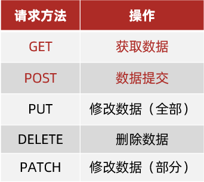

# Gin

## 基础知识扫盲

url：统一资源定位符，简称网址，用于定位网络中的资源（资源指的是：网页，图片，数据，视频，音频等等）

url的三个重要部分：协议，域名，资源路径

```
- 协议：游览器和服务器之间传输数据(或者叫进行通信)的格式
- 域名：服务器在网络中的地址
- 资源路径：资源在服务器中具体的位置
```

查询参数：发送请求时额外携带的信息。

语法形式：在 url 网址后面用`?`拼接的键值对,拼接格式为：`http://xxxx.com/xxx/xxx?参数名1=值1&参数名2=值2`

**请求方法**

请求方法是一些固定单词的英文，例如：GET，POST，PUT，DELETE，PATCH（这些都是http协议规定的）

每一种请求方法都对应一种操作。对服务器资源,要执行的操作




**http协议**

请求报文：是浏览器按照协议规定的格式发送给服务器的内容


这里的格式包含：

* 请求行：请求方法，URL，协议
* 请求头：以键值对的格式携带的附加信息，比如：Content-Type（指定了本次传递的内容类型）
* 空行：分割请求头，空行之后的是发送给服务器的资源    【注意：在新版浏览器中空行已经没有了】
* 请求体：发送的资源

响应报文：是服务器按照协议规定的格式发送给浏览器的内容


响应报文的组成：

* 响应行（状态行）：协议，HTTP响应状态码，状态信息(或者叫响应信息)
* 响应头：以键值对的格式携带的附加信息，比如：Content-Type（告诉浏览器，本次返回的内容类型）
* 空行：分割响应头，控制之后的是服务器返回的资源
* 响应体：返回的资源

**HTTP 响应状态码**

* 用来表明请求是否成功完成
* 例如：404（客户端要找的资源，在服务器上不存在）
* 2xx的状态码都表示本次请求成功


## 安装Gin

```go
go get -u github.com/gin-gonic/gin
```

## 快速开始

```
1、初始化一个路由引擎
	engine1 = gin.Default()
	engine2 = gin.New()
2、定义路由
	1、路由规则。2、处理函数
3、启动HTTP服务器（也就是启动一个web服务），监听端口
	engine1.Run([主机地址:端口号])，默认主机地址为localhost，默认端口为8080
```

> `gin.Default`会默认使用`Logger`和`Recovery`中间件。
>
> - **Logger中间件**：记录日志
> - **Recovery中间件**：出现panic后恢复程序的

```go
package main

import (
	"github.com/gin-gonic/gin"
)

func main() {
	// 创建一个默认的路由引擎
	r := gin.Default()

	// 定义路由（路由规则，处理函数）
	//如果访问路径符合这个路由规则 ,就会自动执行处理函数
    //这个处理函数的作用就是处理你发送的这个请求
	r.GET("/", func(c *gin.Context) {
        //返回string响应
		c.String(200, "Hello, Gin!")
	})

	// 启动HTTP服务器，监听端口8080
	r.Run(":8080")
}
```

当显示**listening and serving HTTP on :8080** 时表示服务器启动成功

**设置gin的运行模式**：

```
gin.SetMode(gin.DebugMode)

a. debug:输出详细的日志信息 (开发环境)
b. release:输出主要的日志信息（生产环境）
c. test:关闭输出日志信息（测试环境）
```

## gin.Context

**gin.Context**gin框架最核心的一个类型，包含了与HTTP**请求和响应**相关的所有信息


## 响应数据

返回一个xxx格式的数据

```go
package main

import (
	"github.com/gin-gonic/gin"
)
//结构体标签，结构体字段的附加信息。与其他数据相互转化时会用到
//字段名必须大写
type xmlStruct struct {
	Name  string `xml:"name"`
	Email string `xml:"email"`
}

func main() {
	r := gin.Default()

	//响应string，返回一个字符串
	r.GET("/string", func(c *gin.Context) {
		c.String(200, "响应字符串")
	})
	//响应json，返回一个json数据
	r.GET("/json", func(c *gin.Context) {
		c.JSON(200, gin.H{
			"name":  "xiaoliu",
			"email": "xxxxxx@email.com",
		})
	})
	//响应xml,返回一个xml数据
	r.GET("/xml", func(c *gin.Context) {
		c.XML(200, xmlStruct{
			Name:  "config.xml",
			Email: "xxxxxx@email.com",
		})
	})
	//响应文件
	//c.File(),将文件内容返回
	//c.FileAttachment(),将这个文件返回（下载文件）
	r.GET("/file", func(c *gin.Context) {
		c.File("aaa.png")
		//c.FileAttachment("aaa.png", "a1.png")
	})

	r.Run(":8080")
}
```

> gin.H是map[string]interface的衍生类型
>

## 获取参数

```go
package main

import (
	"fmt"
	"github.com/gin-gonic/gin"
	"net/http"
)

type SearchQuery struct {
	Q    string `form:"q"`
	Page int    `form:"page"`
}

func main() {
	r := gin.Default()

    //路径参数，[ :xxx ]   通过Param("xxx")获取,获取这个参数对应的实际值
	//GET /user/123
	r.GET("/user/:id", func(c *gin.Context) {
		id := c.Param("id")
		c.String(http.StatusOK, "User ID: %s", id)
	})

	//查询参数，[  ?key=value  ]    通过Query("key")获取来值
	//GET /search?q=golang
	r.GET("/search", func(c *gin.Context) {
		query := c.Query("q") //参数不存在，返回空字符串
		c.String(http.StatusOK, "Search Query: %s", query)
	})

	//查询参数，[  ?key=value  ]   通过DefaultQuery()获取
	//GET /search
	r.GET("/search01", func(c *gin.Context) {
		query := c.DefaultQuery("q", "python") //参数不存在，会返回默认值
		c.String(http.StatusOK, "Search Query: %s", query)
	})

	//查询参数，通过ShouldBindQuery()绑定到结构体
	//GET /search?q=golang&page=2
	type SearchQuery struct {
		Q    string `form:"q"`
		Page int    `form:"page"`
        
	r.GET("/search02", func(c *gin.Context) {
		var query SearchQuery
		if err := c.ShouldBindQuery(&query); err != nil {
			c.JSON(http.StatusBadRequest, gin.H{"error": err.Error()})
			return
		}

		c.JSON(http.StatusOK, gin.H{"query": query.Q, "page": query.Page})
	})
	//表单参数，PostForm()
	r.POST("/form", func(c *gin.Context) {
		//username := c.PostForm("username") //参数不存在返回空字符串
		username := c.DefaultPostForm("username", "11111") //参数不存在返回默认值
		fmt.Println(username)
		c.String(http.StatusOK, "Username: %s", username)
	})
	r.Run(":8080")
}
```

## 路由分组

你可以为一组路由定义一个共同的前缀，从而减少代码冗余

```GO
r.Group("/xxx")
```

路由分组后，使用**路由组**来定义路由。

**但是，最后服务的启动是通过路由引擎来启动的**

````go
package main

import (
	"github.com/gin-gonic/gin"
	"net/http"
)

// SetupRoutes 设置路由
func SetupRoutes(r *gin.Engine) {
	// 根组
	r.GET("/", func(c *gin.Context) {
		c.String(http.StatusOK, "Hello, World!")
	})

	// 用户组
	userGroup := r.Group("/user")
	{
		userGroup.GET("/:id", func(c *gin.Context) {
			id := c.Param("id")
			c.String(http.StatusOK, "User ID: %s", id)
		})

		userGroup.POST("/create", func(c *gin.Context) {
			c.String(http.StatusOK, "User created")
		})
	}

	// 搜索组
	searchGroup := r.Group("/search")
	{
		searchGroup.GET("", func(c *gin.Context) {
			query := c.Query("q")
			c.String(http.StatusOK, "Search Query: %s", query)
		})
	}

	// 表单组
	formGroup := r.Group("/form")
	{
		formGroup.POST("", func(c *gin.Context) {
			username := c.PostForm("username")
			c.String(http.StatusOK, "Username: %s", username)
		})
	}
}
func main() {
	r := gin.Default()

	// 注册路由
	SetupRoutes(r)

	// 启动服务器
	r.Run(":8080")
}

````

## 自定义控制器

自定义控制器目的就是将业务逻辑和路由逻辑分离开

**业务逻辑**：定义路由时的处理函数。     **路由逻辑**：定义路由的方法

控制器：就是一个结构体

将定义路由时的处理函数抽取出来，封装到结构体中

**示例目录结构**

```go
your_project/
├── main.go
├── controllers/
│   ├── user_controller.go
│   ├── search_controller.go
│   └── form_controller.go
└── routes/
    └── routes.go
```

**主文件（main.go）**

```go
package main

import (
	"awesomeProject/controllers"
	"awesomeProject/routes"
	"github.com/gin-gonic/gin"
)

func main() {
	r := gin.Default()

	// 注册控制器,返回结构体指针
	userController := controllers.NewUserController()
	searchController := controllers.NewSearchController()
	formController := controllers.NewFormController()

	// 注册路由
	routes.SetupRoutes(r, userController, searchController, formController)

	// 启动服务器
	r.Run(":8080")
}

```

**控制器文件（controllers/user_controller.go）**

```go
package controllers

import (
	"github.com/gin-gonic/gin"
	"net/http"
)

// UserController 用户控制器
type UserController struct{}

// NewUserController 创建一个新的用户控制器
func NewUserController() *UserController {
	return &UserController{}
}

// GetUser 获取用户信息
func (uc *UserController) GetUser(c *gin.Context) {
	id := c.Param("id")
	c.String(http.StatusOK, "User ID: %s", id)
}

// CreateUser 创建用户
func (uc *UserController) CreateUser(c *gin.Context) {
	c.String(http.StatusOK, "User created")
}
```

**控制器文件（controllers/search_controller.go）**

```go
package controllers

import (
	"github.com/gin-gonic/gin"
	"net/http"
)

// SearchController 搜索控制器
type SearchController struct{}

// NewSearchController 创建一个新的搜索控制器
func NewSearchController() *SearchController {
	return &SearchController{}
}

// Search 搜索
func (sc *SearchController) Search(c *gin.Context) {
	query := c.Query("q")
	c.String(http.StatusOK, "Search Query: %s", query)
}
```

**控制器文件（controllers/form_controller.go）**

```go
package controllers

import (
	"github.com/gin-gonic/gin"
	"net/http"
)

// FormController 表单控制器
type FormController struct{}

// NewFormController 创建一个新的表单控制器
func NewFormController() *FormController {
	return &FormController{}
}

// SubmitForm 提交表单
func (fc *FormController) SubmitForm(c *gin.Context) {
	username := c.PostForm("username")
	c.String(http.StatusOK, "Username: %s", username)
}
```

**路由文件（routes/routes.go）**

```go
package routes

import (
	"awesomeProject/controllers"
	"github.com/gin-gonic/gin"
	"net/http"
)

// SetupRoutes 设置路由
func SetupRoutes(r *gin.Engine, userController *controllers.UserController, searchController *controllers.SearchController, formController *controllers.FormController) {
	// 根组
	r.GET("/", func(c *gin.Context) {
		c.String(http.StatusOK, "Hello, World!")
	})

	// 用户组
	userGroup := r.Group("/user")
	{
		userGroup.GET("/:id", userController.GetUser)
		userGroup.POST("/create", userController.CreateUser)
	}

	// 搜索组
	searchGroup := r.Group("/search")
	{
		searchGroup.GET("", searchController.Search)
	}

	// 表单组
	formGroup := r.Group("/form")
	{
		formGroup.POST("", formController.SubmitForm)
	}

	// 更多分组...
}
```

**访问示例**

```go
根路径：
	访问 http://localhost:8080/，响应为 Hello, World!

用户路径：
    访问 http://localhost:8080/user/123，响应为 User ID: 123
    使用 POST 请求访问 http://localhost:8080/user/create，响应为 User created

搜索路径：
	访问 http://localhost:8080/search?q=golang，响应为 Search Query: golang

表单路径：
	使用 POST 请求访问 http://localhost:8080/form，表单数据为 username=john_doe，响应为 Username: john_doe
```

## 中间件

**【中间件】**：本质上就是处理函数。他会在处理函数前,后执行一些操作。

中间件，再最后一个处理函数前面的这些处理函数，就是中间件

**Next()**：继续执行下一个中间件或者处理函数。（一个处理函数对应一个请求）

**Abort()**：终止执行后面的处理函数或者中间件

在Next()前的代码，在处理函数之前执行。在Next()后的代码，在处理函数之后执行。

```go
func initMiddleware(ctx *gin.Context) {
	fmt.Println("我是一个中间件-1")
	ctx.Next()
	fmt.Println("我是一个中间件-2")
}
func main() {
	gin.SetMode(gin.TestMode)
	r := gin.Default()
	r.GET("/", initMiddleware, func(ctx *gin.Context) {
		fmt.Println("首页--中间件演示")
	})
	r.GET("/news", initMiddleware, func(ctx *gin.Context) {
		fmt.Println("新闻页面--中间件演示")
	})
	r.Run(":8080")
}
```

执行结果

```
我是一个中间件-1
首页--中间件演示
我是一个中间件-2
[GIN] 2024/11/15 - 09:15:33 | 200 |            0s |             ::1 | GET      "/"
我是一个中间件-1
新闻页面--中间件演示
我是一个中间件-2
[GIN] 2024/11/15 - 09:15:42 | 200 |            0s |             ::1 | GET      "/news"
```

**【注意】**

中间件中没有使用`Next()`，就把这个中间件当成普通函数就行。

中间件中使用了`Next()`，那么这个中间件Next()后面的代码，会等到处理函数执行完之后执行。

```go
package main

import (
	"github.com/gin-gonic/gin"
	"log"
	"net/http"
)

// Middleware1 第一个中间件
func Middleware1(c *gin.Context) {
	log.Println("Middleware1: Before Next")
	c.Next()
	log.Println("Middleware1: After Next")//处理函数执行完之后执行
}

// Middleware2 第二个中间件
func Middleware2(c *gin.Context) {
	log.Println("Middleware2: Before Next")
	//c.Next()
	log.Println("Middleware2: After Next")
}

// Middleware3 第三个中间件
func Middleware3(c *gin.Context) {
	log.Println("Middleware3: Before Next")
	c.Next()
	log.Println("Middleware3: After Next")////处理函数执行完之后执行
}

func main() {
	r := gin.Default()

	// 定义路由
	r.GET("/", Middleware1, Middleware2, Middleware3, func(c *gin.Context) {
		log.Println("Route Handler")
		c.String(http.StatusOK, "Hello, World!")
	})

	r.Run(":8080")
}
```

执行结果

```
2024/11/15 09:30:32 Middleware1: Before Next
2024/11/15 09:30:32 Middleware2: Before Next
2024/11/15 09:30:32 Middleware2: After Next
2024/11/15 09:30:32 Middleware3: Before Next
2024/11/15 09:30:32 Route Handler
2024/11/15 09:30:32 Middleware3: After Next
2024/11/15 09:30:32 Middleware1: After Next
```

一条路由配置多个中间件的执行顺序(前提：都是用了Next)：从前到后，从后到前 (这个`后`指的是处理函数执行完)

**全局中间件**

之间讲的是局部中间件，只给某个特定的路由使用中间件。

全局中间件，会将这个中间件应用到所有路由上。

```
r.use(中间件)
```

```go
package main

import (
	"github.com/gin-gonic/gin"
	"log"
	"net/http"
)

// Middleware1 第一个中间件
func Middleware1(c *gin.Context) {
	log.Println("Middleware1: Before Next")
	c.Next()
	log.Println("Middleware1: After Next")
}

// Middleware2 第二个中间件
func Middleware2(c *gin.Context) {
	log.Println("Middleware2: Before Next")
	c.Next()
	log.Println("Middleware2: After Next")
}

func main() {
	r := gin.Default()

	r.Use(Middleware1)
	// 定义路由
	r.GET("/", Middleware2, func(c *gin.Context) {
		log.Println("Route Handler")
		c.String(http.StatusOK, "Hello, World!")
	})

	r.Run(":8080")
}
```

全局中间件先执行，局部中间件后执行

```
2024/11/15 09:44:04 Middleware1: Before Next
2024/11/15 09:44:04 Middleware2: Before Next
2024/11/15 09:44:04 Route Handler
2024/11/15 09:44:04 Middleware2: After Next
2024/11/15 09:44:04 Middleware1: After Next
```

总结：

- 局部中间件：在定义路由时，处理函数前面使用
- 全局中间件：在定义路由前使用

**在路由分组中配置中间件**

写法一、使用 `Group` 方法的第二个参数

```go
路由组 := r.Group("/", 中间件)
```

```go
package main

import (
	"fmt"
	"github.com/gin-gonic/gin"
)

func initMiddleware02(ctx *gin.Context) {
	fmt.Println("我是一个中间件-1")
	ctx.Next()
	fmt.Println("我是一个中间件-2")
}
func main() {
	r := gin.Default()

	userGroup := r.Group("/user", initMiddleware02)
	{
		userGroup.GET("/profile", func(c *gin.Context) {
			fmt.Println("这是一个profile")
		})
		userGroup.GET("/settings", func(c *gin.Context) {
			fmt.Println("这是一个setting")
		})
	}
	r.Run(":8080")
}
```

写法二、使用 `Use` 方法

```
路由组.Use(中间件)
```

```go
package main

import (
	"fmt"
	"github.com/gin-gonic/gin"
)

func initMiddleware02(ctx *gin.Context) {
	fmt.Println("我是一个中间件-1")
	ctx.Next()
	fmt.Println("我是一个中间件-2")
}
func main() {
	r := gin.Default()

	userGroup := r.Group("/user")
	{
		userGroup.Use(initMiddleware02)
		userGroup.GET("/profile", func(c *gin.Context) {
			fmt.Println("这是一个profile")
		})
		userGroup.GET("/settings", func(c *gin.Context) {
			fmt.Println("这是一个setting")
		})
	}
	r.Run(":8080")
}
```

**在中间件中设置共享数据**，后续的中间件和处理函数可以使用这个数据

```
设置数据  c.Set("键",值)
获取数据  c.get("键")
```

```go
package main

import (
	"github.com/gin-gonic/gin"
	"net/http"
)

// setSharedDataMiddleware 是一个设置共享数据的中间件
func setSharedDataMiddleware() gin.HandlerFunc {
	return func(c *gin.Context) {
		// 设置共享数据
		c.Set("userID", 123)
		c.Set("userName", "Alice")

		// 继续处理请求
		c.Next()
	}
}

func main() {
	r := gin.Default()

	// 定义一个中间件，用于设置共享数据
	r.Use(setSharedDataMiddleware())

	// 定义一个路由，用于访问共享数据
	r.GET("/ping", func(c *gin.Context) {
		// 获取共享数据
		userID, _ := c.Get("userID")
		userName, _ := c.Get("userName")

		c.JSON(http.StatusOK, gin.H{
			"message":  "ping",
			"userID":   userID,
			"userName": userName,
		})
	})

	r.Run(":8080")
}
```

**中间件的注意事项**

不建议在 Goroutine 中直接使用原始的 `*gin.Context` 对象，而是需要使用其副本（通过 `c.Copy()` 方法生成）

## 数据的绑定

**bind和shouldBind**： 会根据**Content-Type** 的值来选择合适的绑定方法

**bind方法**：绑定失败，会自动返回400的响应状态码

**shouldBind方法**：绑定失败，需要开发者自己设置响应状态码

```go
type User struct {
	Name  string `json:"name" binding:"required"`
	Email string `json:"email" binding:"required,email"`
}

func main() {
	r := gin.Default()

	// 创建用户
	r.POST("/users", createUserWithBind)

	r.Run(":8080")
}

// createUserWithBind
func createUserWithBind(c *gin.Context) {
	var user User
	//bind绑定失败，会自动返回400的响应状态码
	if err := c.Bind(&user); err != nil {
		return
	}
	//ShouldBind绑定失败,不会自动返回400的响应状态码
	//if err := c.ShouldBind(&user); err != nil {
	//
	//	return
	//}
	c.JSON(http.StatusOK, gin.H{"message": "User created", "user": user})
}
```

## 文件的上传

### 单文件上传

**获取上传文件**：c.FormFile("文件名")，文件名是 `<input type="file1" name="file">`里面的name值

**保存上传文件**：c.SaveUploadedFile(文件对象, 路径及文件名)

**获取原始文件名**：file.Filename

**html页面**

```html
<form action="/up" method="POST" enctype="multipart/form-data">
    <input type="file" name="file" />
    <button type="submit">Upload</button>
</form>
```

**示例代码**

```go
r := gin.Default()

// 单文件上传
r.POST("/up", func(c *gin.Context) {
    // 获取上传的文件
    file, err := c.FormFile("file1")
    if err != nil {
        c.JSON(http.StatusBadRequest, gin.H{"error": err.Error()})
        return
    }

    // 保存文件到指定目录
    dst := fmt.Sprintf("./uploads/%s", file.Filename)//生成目录及文件名
    fmt.Println(dst)
    //保存文件
    if err := c.SaveUploadedFile(file, dst); err != nil {
        c.JSON(http.StatusInternalServerError, gin.H{"error": err.Error()})
        return
    }
    c.JSON(http.StatusOK, gin.H{"message": "File uploaded successfully", "filename": file.Filename})
})

r.Run(":8080")
```


### 多文件上传

**获取上传的所有文件**：c.MultipartForm()，返回值是结构体

**获取上传的name值为xxx的文件**：form.File["xxx"]，返回值是切片

**html页面**

```html
<form action="/upload-multiple" method="POST" enctype="multipart/form-data">
    <input type="file" name="files" multiple />
    <button type="submit">Upload</button>
</form>
```

**示例代码**

```go
r := gin.Default()

// 设置静态文件目录
r.Static("/uploads", "./uploads")

// 多文件上传
r.POST("/upload-multiple", func(c *gin.Context) {
    // 获取表单数据,获取上传的所有文件(结构体)
    form, err := c.MultipartForm()
    if err != nil {
        c.JSON(http.StatusBadRequest, gin.H{"error": err.Error()})
        return
    }
    // 获取上传的name值为png1的文件(切片)
    files := form.File["png1"]
    fmt.Println("files", files)

    // 遍历上传的文件
    for _, file := range files {
        fmt.Println(file.Filename)

        // 保存文件到指定目录
        dst := fmt.Sprintf("./uploads/%s", file.Filename)
        if err := c.SaveUploadedFile(file, dst); err != nil {
            c.JSON(http.StatusInternalServerError, gin.H{"error": err.Error()})
            return
        }
    }

    c.JSON(http.StatusOK, gin.H{"message": "Files uploaded successfully", "count": len(files)})
})

r.Run(":8080")
```


## Cookie

Cookie是一种在客户端浏览器存储数据的一种机制

Cookie是一种存储在客户端浏览器中的键值对数据，用于在客户端和服务器之间传递信息。每次向服务器发送请求时，浏览器都会自动携带这些Cookie信息。

**【设置Cookie】**

在Gin框架中，可以通过`c.SetCookie`方法设置Cookie

```go
c.SetCookie(name, value string, maxAge int, path, domain string, secure, httpOnly bool)
```

- name：Cookie的键
- value：Cookie的值
- maxAge：Cookie的过期时间（秒）
- path：Cookie的路径，哪些路径下可以使用cookie ，`"/"`表示Cookie在整个域名下都有效
- domain：Cookie的域名，哪个域名下可以使用这个cookie。本地调试时配置为localhost，正式上线时配置为域名。
- secure：只在 HTTPS 请求中发送 Cookie。`true`表示只能通过HTTPS传输，`false`表示可以通过HTTP传输
- httpOnly：是否仅通过HTTP访问，`true`表示Cookie不能通过JavaScript访问。

**【获取Cookie】**

通过`c.Cookie`方法来获取指定名称的Cookie值

**【删除Cookie】**

通过设置Cookie的过期时间小于0来删除Cookie（一般为-1）

```go
r := gin.Default()

r.GET("setcookie", func(c *gin.Context) {
    //设置cookie
    c.SetCookie("username", "liuliuliu", 3600, "/", "localhost", false, true)
    c.String(200, "cookie已设置")
})
r.GET("/getcookie", func(c *gin.Context) {
    //获取cookie
    value, _ := c.Cookie("username")
    c.String(200, "用户名：%s", value)
})
r.GET("/delcookie", func(c *gin.Context) {
    //删除cookie
    c.SetCookie("username", "liuliuliu", -1, "/", "localhost", false, true)
    c.String(200, "cookie已删除")
})
r.Run(":8080")
```

## Session

Session是一种在服务器端存储数据的一种机制

**Session工作流程**：

- 当用户第一次访问网站时，服务器会为该用户创建一个唯一的Session ID，并将其存储在服务器或者数据库上
- 然后服务器通过响应头将Session ID存储到客户端的Cookie中
- 客户端后续的请求中，会将Session ID,发送给服务器，服务器根据这个Session ID，找到对应的用户数据，从而恢复用户的状态

**gin中使用session**

Gin 官方没有给我们提供 Session 相关的文档，这个时候我们可以使用第三方的 Session 中间件来实现

**安装 session 包**

```go
go get -u github.com/gin-contrib/sessions
```

**初始化Session中间件**

```go
store := cookie.NewStore([]byte("secret"))
r.Use(sessions.Sessions("mysession", store)) 
```

**设置Session数据**

- **键（key）**：推荐使用字符串类型
- **值（value）**：可以是任意类型（`interface{}`）

```go
session := sessions.Default(c)//获取session对象
session.Set("key", value)
session.Save()//每次修改数据后都要保存
```

每次修改数据（添加，修改，删除）后都要通过**session.Save()**将修改后的数据保存到存储引擎中

- 修改数据：对之前的key重新赋值
- 删除某个Session数据： session.Delete("key")
- 删除全部Session数据：session.Clear()

**获取Session数据**

```go
value := session.Get("key")
```

**Cookie作为存储引擎**

Cookie 中的值既包含 Session ID 也包含 Session 数据，Session ID并没有独立存储

**示例**

```go
package main

import (
	"github.com/gin-contrib/sessions"
	"github.com/gin-contrib/sessions/cookie"
	"github.com/gin-gonic/gin"
)

func main() {
	r := gin.Default()

	//session中间件的初始化
	//创建基于cookie的存储引擎,,secret是加密的密钥，密钥可以随便设置
	store := cookie.NewStore([]byte("secret"))
	r.Use(sessions.Sessions("mysession", store)) //配置中间件,mysession是cookie的键

	r.GET("/set", func(c *gin.Context) {
		//获取Session对象
		session := sessions.Default(c)
		//配置session过期时间
		session.Options(sessions.Options{
			MaxAge: 60, // 60s
		})
		//设置Session数据,并保存
		session.Set("username", "xiaoliu")
		session.Save()

		c.JSON(200, gin.H{"message": "session设置成功"})
	})
	r.GET("/get", func(c *gin.Context) {
		//获取Session对象
		session := sessions.Default(c)
		//获取session数据
		username := session.Get("username")

		c.JSON(200, gin.H{"message": "session获取成功", "username": username})
	})
	r.Run(":8080")
}
```

**Session的配置项**

```go
store.Options(sessions.Options{
    Path:     "/",          // 设置 Cookie 作用路径,哪些路径可以使用该 Cookie
    MaxAge:   3600,         // Session 数据和 Cookie 的有效期（单位：秒）
    Expires:  time.Now().Add(24 * time.Hour), // 设置具体过期时间（可选）
    Secure:   true,         // 只在 HTTPS 请求中发送 Cookie
    HttpOnly: true,         // 防止 JavaScript 访问 Cookie
    SameSite: http.SameSiteStrictMode, // 防止 CSRF 攻击
})
```

**session的过期时间**

是指两个方面 1、session数据在存储引擎中的过期时间。2、sessionn id在cookie中的过期时间

如，过期时间是3600s，这3600s过后，session数据和session id都过期了

```go
session.Options(sessions.Options{
    MaxAge:3600
})
```


