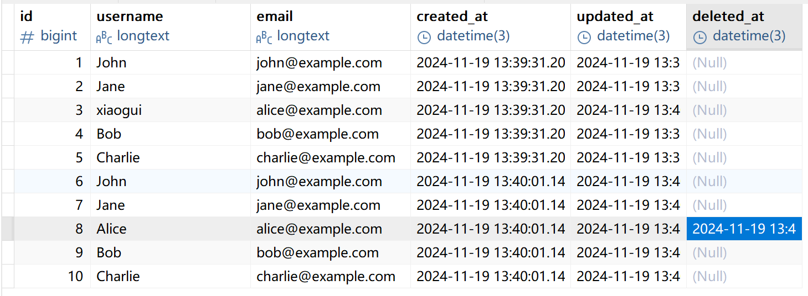

# grom

## 什么是ORM

Object Relational Mapping：对象关系映射

结构体 和 SQL数据库存在映射，这个时候就有了ORM语句

一句话说：就是将数据库中的表和结构体进行对应的关系

**安装**

```go
//安装MySQL驱动
go get -u gorm.io/driver/mysql
//安装gorm包
go get -u gorm.io/gorm
```

**连接mysql**

```go
dsn := "root:123456@tcp(localhost:3306)/school?charset=utf8mb4&parseTime=True&loc=Local"
db, err := gorm.Open(mysql.Open(dsn), &gorm.Config{})
if err != nil {
    panic("failed to connect database: " + err.Error())
}
?charset=utf8mb4&parseTime=True&loc=Local
```

- `user:password`：数据库用户名和密码。
- `@tcp(127.0.0.1:3306)`：使用 TCP 协议连接到本地 MySQL 服务器的默认端口。
- `/dbname`：连接到名为 `dbname` 的数据库。
- `?charset=utf8mb4&parseTime=True&loc=Local`：指定字符集、时间解析、时区。

**定义模型**

**GORM 使用结构体来定义数据库模型。结构体的字段对应数据库表的列。**

可以通过标签自定义数据库表的列名

模型名和表名映射规则如下：

```
a. 如果模型名没有驼峰命名，那么表名就是：模型名小写+复数形式： 如模型名User ——> 表名users
b. 如果模型名有驼峰命名，那么表名就是：大写变小写并在前面加下划线，最后加复数形式：如模型名UserInfo ——> 表名user_infos
c. 如果模型名有连续的大写字母，那么表名就是：连续的大写字母变小写，驼峰前加下划线，字母变小写，最后加复数形式：如模型名：DBUserInfo ——> 表名db_user_infos
```

**模型标签**

标签定义：

```go
`gorm:"标签内容"`
```

**标签定义部分，多个标签定义可以使用分号（;）分隔**

gorm常用标签如下：

| 标签       | 说明     | 例子                                                         |
| :--------- | :------- | :----------------------------------------------------------- |
| column     | 指定列名 | `gorm:"column:username"`                                     |
| primaryKey | 指定主键 | `gorm:"column:id; PRIMARY_KEY"`                              |
| -          | 忽略字段 | `gorm:"-"` GORM 在数据库操作中忽略该字段，就是不会将映射到数据库表中的任何列 |

**gorm.Model**：是gorm内置的结构体。

```go
type Model struct {
	ID        uint `gorm:"primarykey"`
	CreatedAt time.Time   //记录的创建时间
	UpdatedAt time.Time   //记录的更新时间
	DeletedAt DeletedAt `gorm:"index"` //记录的删除时间，用来实现软删除功能的
}
```

## 自动迁移

**自动创建或者更新(添加字段)数据库表结构**：AutoMigrate(&结构体)

主键：如果没有在标签中指名哪个字段是主键，默认ID字段作用主键，ID字段作为主键，会自动添加自增长约束

```go
type User struct {
	Id    int
	Name  string
	Age   int
	Email string
}
func main() {
	dsn := "root:123456@tcp(127.0.0.1:3306)/s1?charset=utf8mb4&parseTime=True&loc=Local"
	db, err := gorm.Open(mysql.Open(dsn), &gorm.Config{})
	if err != nil {
		panic("failed to connect database")
	}
	// 自动迁移
	db.AutoMigrate(&User{})
}
```

## 原生SQL

**执行查询语句**

**`db.Raw()`**：执行原生的SQL语句，可以使用`?`占位符，用于安全的传递参数 （返回结果）

**`Scan`**：将查询结果扫描（或者叫映射）到指定的变量 (通常是切片或者结构体切片中) 中

```go
type User struct {
	ID    uint
	Name  string
	Email string
}

var users []User
//查询所有数据 
db.Raw("SELECT * FROM users").Scan(&users)
for _, user := range users {
    fmt.Printf("User: %+v\n", user)
}
```

**执行非查询语句**

`db.Exec()`：执行原始的SQL语句（不返回结果）

`result.Error`：查询过程中发生的错误

`result.RowsAffected`：受影响的行数

```go
//插入数据
result := db.Exec("INSERT INTO users (name, email) VALUES (?, ?)", "xiaoxiao", "xiaoxiao@example.com")
// 检查执行结果
if result.Error != nil {
    fmt.Printf("插入失败: %v\n", result.Error)
} else {
    fmt.Printf("受影响的行数: %d\n", result.RowsAffected)
}
```

## 钩子函数

**在特定的时机会自动执行的函数**

钩子函数如果返回错误之后，对应的操作不会生效的。

eg. 添加操作,BeforeCreate和AfterCreate返回错误，那么这个添加操作就不生效

钩子函数如下：

```go
// 在创建记录之前执行
func (u *User) BeforeCreate(tx *gorm.DB) (err error) {
    fmt.Println("BeforeCreate hook called")
    // 数据验证示例：确保Email不为空
    if u.Email == "" {
        return fmt.Errorf("email cannot be empty")
    }
    return nil
}

// 在创建记录之后执行
func (u *User) AfterCreate(tx *gorm.DB) (err error) {
    fmt.Println("AfterCreate hook called")
    // 日志记录示例：记录创建的用户信息
    fmt.Printf("User created: %+v\n", u)
    return nil
}

// 在更新记录之前执行
func (u *User) BeforeUpdate(tx *gorm.DB) (err error) {
    fmt.Println("BeforeUpdate hook called")
    // 数据验证示例：确保Email不为空
    if u.Email == "" {
        return fmt.Errorf("email cannot be empty")
    }
    return nil
}

// 在更新记录之后执行
func (u *User) AfterUpdate(tx *gorm.DB) (err error) {
    fmt.Println("AfterUpdate hook called")
    // 日志记录示例：记录更新的用户信息
    fmt.Printf("User updated: %+v\n", u)
    return nil
}

// 在删除记录之前执行
func (u *User) BeforeDelete(tx *gorm.DB) (err error) {
    fmt.Println("BeforeDelete hook called")
    // 数据验证示例：确保ID不为空
    if u.ID == 0 {
        return fmt.Errorf("ID cannot be empty")
    }
    return nil
}

// 在删除记录之后执行
func (u *User) AfterDelete(tx *gorm.DB) (err error) {
    fmt.Println("AfterDelete hook called")
    // 日志记录示例：记录删除的用户信息
    fmt.Printf("User deleted: %+v\n", u)
    return nil
}
```

接收钩子函数返回的错误

```go
//删除数据
err = db.Delete(&user, 5).Error//err中可以拿到钩子函数返回的错误
```

## 插入记录

**插入一条记录**

```go
type User struct {
	Id    uint
	Name  string
	Email string
}
user := User{Name: "John", Email: "john@example.com"}
result := db.Create(&user)
```

**插入多条记录**

```go
users := []User{
    {Name: "John", Email: "john@example.com"},
    {Name: "Jane", Email: "jane@example.com"},
    {Name: "Alice", Email: "alice@example.com"},
    {Name: "Bob", Email: "bob@example.com"},
    {Name: "Charlie", Email: "charlie@example.com"},
}
db.Create(&users)
```

> create函数接收的参数是结构体的指针或者是切片

## 查询记录

查询的结果在结构体或者结构体切片中

**查看拼接好的SQL**：通过Debug()查看

```go
var firstUser User
db.Debug().First(&firstUser)
//SELECT * FROM users ORDER BY id ASC LIMIT 1
```

**主键升序排序后的的第一条记录**：First(&结构体)

```go
type User struct {
	Id    uint
	Name  string
	Email string
}

var firstUser User
//无条件
db.First(&firstUser) 
//SELECT * FROM users ORDER BY id ASC LIMIT 1

//有条件
db.First(&firstUser, "name = ?", "John")//排序后name=john的第一条记录
//SELECT * FROM users WHERE name = 'John' ORDER BY id ASC LIMIT 1;
```

**主键降序排序后的第一条记录**：Last(&结构体)

```go
var lastUser User
//无条件
db.Last(&lastUser)
//SELECT * FROM users ORDER BY id DESC LIMIT 1;

//有条件
db.Last(&lastUser, "name = ?", "John")
//SELECT * FROM users WHERE name = 'John' ORDER BY id DESC LIMIT 1;
```

**不进行排序的第一条记录**：Take(&结构体)

```go
var takenUser User
//无条件
db.Take(&takenUser)
//SELECT * FROM users LIMIT 1;

//有条件
db.Debug().Take(&takenUser, "name = ?", "John")
//SELECT * FROM users WHERE name = 'John' LIMIT 1;
```

**where条件查询**

```go
var whereUser User
db.Where("id= ? ", 3).First(&whereUser)//升序排之后id等于3的第一条记录
//select * form users where id = 3 order by id asc limit 1
```

**where子查询**

```go
subQuery := db.Model(&User{}).Select("id").Where("name = ?", "Alice")
db.Where("id IN (?)", subQuery).Find(&users)
```

**find查询**

```go
var whereUser []User
db.Find(&whereUser)//查询所有数据
//SELECT * FROM users

db.Find(&whereUser, "id = ?", 3)//按条件查询数据
//SELECT * FROM users WHERE id = 3
```

## 更新记录

**更新单个字段**：Update( )

方式一 ：将结构体主键字段作为条件

```go
type User struct {
    Id    uint
    Name  string
    Email string
}

var user User
db.First(&user, 1) //查询数据的目的就是给id字段赋值

// 更新单个字段
db.Model(&user).Update("name", "小小")//更新记录的条件是user结构体ID字段的值
//user实例id字段没有值，就会出现WHERE conditions required
// SQL: UPDATE users SET name = 'UpdatedName' WHERE id = 1;
```

方式二：直接指定条件

```go
type User struct {
	Id    int
	Name  string `gorm:"column:username"`
	Email string
	gorm.Model
}


db.Model(&User{}).Where("id = ?", 3).Update("username", "xiaogui")
```

> 会更新零值，如给name设置为空字符时

**更新多个字段**：Updates（）

参数可以是结构体或 `map`

**使用结构体**

将结构体主键字段作为条件

```go
var user User
user.Id = 4  //作为条件拼接到sql中
db..Model(&user).Updates(User{Name: "xiao666", Email: ""})
```

直接指定条件

```go
var user User
db.Model(&user).Where("id = ?", 2).Updates(User{Name: "xiaogui", Email: ""})
//&user指针实例
// SQL: UPDATE users SET name = 'NewName' WHERE id = 1
```

【注意】使用结构体来更新多个字段时，只会更新非零字段。如`Email=""`就不会被更新到数据库表中

**使用map**

将结构体主键字段作为条件

```go
var user User
user.Id = 3 //作为条件拼接到sql中
db.Model(&user).Updates(map[string]interface{}{
    "name":  "xiaogui666",
    "email": "666@.com",
})
//UPDATE users SET email='' , name='xiaogui666' WHERE id = 3
```

直接指定条件

```go
var user User
db.Model(&user).Where("id = 5").Updates(map[string]interface{}{
    "name":  "xiaogui555",
    "email": "",
})
```

> 使用结构体时，不会更新零值
>
> 使用map时，会更新零值

**更新所有字段**：Save()

```go
user := User{Id: 33, Name: "sdasda", Email: "sdasda.com"}
db.Debug().Save(&user)
//UPDATE users SET name=sdasda,email='sdasda.com' WHERE id = 33
```

如果主键在这张表中不存在，那么就会添加这条记录

> 会更新零值

## 删除记录

将结构体主键字段作为条件：

```go
type User struct {
	Id    int
	Name  string
	Email string
}

var user User
db.First(&user, 5)  
//根据主键来删除数据
db.Delete(&user) 
//DELETE FROM users WHERE id = 5
```

直接指定条件：

```go
var user User
db.Where("name like ?", "%Alice%").Delete(&user)//&user == &User{}
//DELETE FROM users WHERE name like '%Alice%'
```

软删除：如果模型定义了 `gorm.DeletedAt` 或内嵌了 `gorm.Model`，默认会启用软删除。

软删除不会真正删除数据，而是将 `DeletedAt` 字段设置为当前时间。通过Gorm查不到这条记录的



永久删除：使用`Unscoped()` 方法，这个方法会忽略软删除机制。

```go
db.Unscoped().Delete(&User{}, 8)
//DELETE FROM `users` WHERE `users`.`id` = 8
```

恢复软删除的数据：1、使用Unscoped找到被删除的记录。2、给这条记录的deleted_At设置为nil

```go
var user []User
db.Unscoped().Where("username like ?", "John").Find(&user)
for _, u := range user {
    db.Unscoped().Model(&u).Update("deleted_At", nil)
}
```

## 高级查询

**or(或)** 

```go
var user []User
db.Debug().Or("username = ?", "xiaogui").Find(&user)
//SELECT * FROM `users` WHERE username = 'xiaogui'
```

和where一起使用

```go
var user []User
db.Debug().Where("id > ?", 8).Or("username = ?", "Bob").Find(&user)
//SELECT * FROM `users` WHERE (id > 8 OR username = 'Bob')
```

注意：`or`要写在`where`后面。放在前面 or就变成and了

```go
var user []User
db.Debug().Or("username = ?", "Bob").Where("id > ?", 8).Find(&user)
//SELECT * FROM `users` WHERE (username = 'Bob' AND id > 8
```

**in(包括)**

注意：gorm没有in这个关键字。通过where来实现的

```go
var user []User
db.Debug().Where("username IN ?", []string{"Alice", "Bob", "xiaogui"}).Find(&user)
//SELECT * FROM `users` WHERE username IN ('Alice','Bob','xiaogui')
```

**Not(非)**

```go
var user []User
db.Debug().Not("username = ?", "xiaogui").Find(&user)
for _, u := range user {
    fmt.Printf("%+v\n", u)
}
//SELECT * FROM `users` WHERE NOT username = 'xiaogui'
```

和where一起使用，（其实，查询条件可以直接写在where条件里面，不需要分开写）

```go
var user []User
db.Debug().Where("id>?", 5).Not("username = ?", "xiaogui").Find(&user)
for _, u := range user {
    fmt.Printf("%+v\n", u)
}
//SELECT * FROM `users` WHERE id>5 AND NOT username = 'xiaogui'
```

**Order(排序)**

注意：排序不可以写在where中

```go
db.Order("age desc").Find(&users)
// SELECT * FROM users ORDER BY age DESC;

db.Order("age desc, name").Find(&users)
// SELECT * FROM users ORDER BY age DESC, name ASC;
```

## 指定模型/表

**显式的指定要操作的模型**：Model(&xxx)

明确的告诉GORM我要对哪张表进行操作。（就是，你要对哪个模型，哪个表进行操作）

**可以忽略Model方法的前提**：你可以根据参数来推断出要操作的模型是谁

```go
var user User
db.Model(&user).Find(&user)//model方法可以省略，可以根据 &user 来推断出要操作的模型是User
```

model的参数可以是：

| 类型       | 描述                     | 示例             |
| ---------- | ------------------------ | ---------------- |
| 模型结构体 | 明确指定目标模型         | `Model(&User{})` |
| 模型实例   | 使用特定实例操作相关数据 | `Model(&user)`   |

**指定要操作的数据库表**：Table("表名")

告诉GORM我要对哪张表进行操作

```go
var user User
db.Table("users").Where("id = ?", 6).Updates(User{Name: "xiaoxiao", Email: "xxel@qq.com"})
//&user指针实例
// SQL: UPDATE users SET name = 'NewName', email = 'newemail@example.com' WHERE id = 1
```

**Scan函数**

将查询结果扫描（或者叫映射）到指定的变量 (通常是结构体切片或者结构体切片) 中

```go
type UserInfo struct {
    UserId    int    `gorm:"column:id"`
    UserName  string `gorm:"column:username"`
    UserEmail string `gorm:"column:email"`
    //字段首字母不能小写
}
var userInfo []UserInfo
db.Model(&User{}).Scan(&userInfo)
//SELECT * FROM `users`
for _, user := range userInfo {
    fmt.Printf("user:%+v\n", user)
}
```

Scan单独使用，就是查询所有的数据，然后扫面到指定变量

Scan方法和查询相关的方法一起使用使用，Scan的作用就是扫描

```go
var userInfo []User
db.Debug().Find(&userInfo).Scan(&userInfo)
for _, user := range userInfo {
    fmt.Printf("user:%+v\n", user)
}
```

**slelect函数**

查询时选择需要的列名，列名可以写在一起，也可以分开写

```go
type UserInfo struct {
    UserName  string `gorm:"column:username"`
    UserEmail string `gorm:"column:email"`
    //字段首字母不能小写
}
var userInfo []UserInfo
db.Model(&User{}).Select("username", "email").Find(&userInfo)
//SELECT `username`,`email` FROM `users`
for _, user := range userInfo {
    fmt.Printf("user:%+v\n", user)
}
```

**Group函数**

对某一列进行分组

```go
type Res struct {
    Username string `gorm:"column:username"`
    Count    int    `gorm:"column:count"`
}
var res []Res
db.Model(&User{}).Select("username,count(id) as count").Group("username").Scan(&res)
//SELECT username,count(id) as count FROM `users` GROUP BY `username`
for _, user := range res {
    fmt.Printf("user:%+v\n", user)
}
```

**去重Distinct()**

对某一列进行去重

```go
var res []string
db.Model(&User{}).Distinct("username").Scan(&res)
// SELECT DISTINCT `username` FROM `users`
```

结合Select方法（推荐，可读性好）

```go
db.Debug().Model(&User{}).Select("username").Distinct().Scan(&res)
//SELECT DISTINCT `username` FROM `users`
```

**分页查询**

mysql中分页查询

- A ：每页的记录数
- B：从哪一行后面读取  ==   (当前页 - 1) * 每页的记录数

```mysql
SELECT * FROM table_name LIMIT A OFFSET B
```

每页显示5条，获取第3页的数据

```mysql
SELECT * FROM table_name LIMIT 5 OFFSET 10 //从第10行后面开始读取
```

**GORM中的分页查询**

```go
// 分页查询 每页2条数据，获取第3页的数据
var users []User
pageNumber := 3
pageSize := 2
db.Limit(pageSize).Offset((pageNumber - 1) * pageSize).Find(&users)
//SELECT * FROM `users` LIMIT 2 OFFSET 4
```

## Scope方法

使用Scope方法的目的是：将通用的查询逻辑封装到函数中，实现功能的复用

Scpoe方法的参数是函数类型，可以接收一个或多个函数参数。这些函数的签名必须为：

```go
func(*gorm.DB) *gorm.DB
```

示例

```go
//查询id > xxx 的用户
func OlderThan(id int) func(db *gorm.DB) *gorm.DB {
	return func(db *gorm.DB) *gorm.DB {
		return db.Where("id > ?", id)
	}
}

// 查询id大于5 的用户
var users []User
db.Scopes(OlderThan(5)).Find(&users)
// 等价于：SELECT * FROM users WHERE id > 5;
```

## 表关系

模型中的 `gorm` 标签是可选的，如果你在 MySQL 中已经创建了表。那么你可以省略 `gorm` 标签。

**预加载**

```go
var users []User
db.Debug().Preload("Profile").Where("id >1").Find(&users)
//预加载，将主表的查询结果(主表id)作为从表的查询条件，然后将从表的查询结果关联主表的查询结果进行关联
```

在**AutoMigrate**时，GORM会自动创建外键约束。那么如何禁止他呢？

```go
db, err := gorm.Open(sqlite.Open("gorm.db"), &gorm.Config{
  DisableForeignKeyConstraintWhenMigrating: true,//禁止生成外键约束
})
```

### 一对一

**建表语句**

```mysql
CREATE TABLE users (
    id INT AUTO_INCREMENT PRIMARY KEY,
    name VARCHAR(100) NOT NULL,
    age INT NOT NULL
);

CREATE TABLE profiles (
    id INT AUTO_INCREMENT PRIMARY KEY,
    bio TEXT NOT NULL,
    userid INT NOT NULL UNIQUE
);

-- 插入主表数据
INSERT INTO users (name, age) VALUES
('xiaogui01', 20),
('xiaogui02', 30),
('xiaogui03', 40);

-- 插入从表数据
INSERT INTO profiles (bio, userid) VALUES
('xiaogui01 是一名大学生', 1),
('xiaogui02 是一名大学辅导员', 2),
('xiaogui03 是一名大学教授', 3);
```

使用原生sql来进行多表查询

```go
// UserProfile 用来承载查询结果
type UserProfile struct {
	Name string
	Age  int
	Bio  string
}

func main() {
	dsn := "root:123456@tcp(127.0.0.1:3306)/s1?charset=utf8mb4&parseTime=True&loc=Local"
	db, err := gorm.Open(mysql.Open(dsn), &gorm.Config{})
	if err != nil {
		panic("failed to connect database")
	}
	// 使用原生 SQL 查询用户和简介信息
	var userProfiles []UserProfile
	query := `SELECT users.name, users.age, profiles.bio
		FROM users
		INNER JOIN profiles ON users.id = profiles.userid`

	result := db.Raw(query).Scan(&userProfiles)
	if result.Error != nil {
		panic(result.Error)
	}
	//输出结果
	for _, up := range userProfiles {
		fmt.Printf("%+v\n", up)
		//fmt.Printf("Name: %s, Age: %d, Bio: %s\n", up.Name, up.Age, up.Bio)
	}
    
}
```

```go
//更新 age 和 bio
updateQuery := `
    UPDATE users
    JOIN profiles ON users.id = profiles.userid
    SET users.age = ?, profiles.bio = ?
    WHERE users.name = ?
`
result := db.Exec(updateQuery, 25, "xiaogui01 是一名it工程师", "xiaogui01")
if result.Error != nil {
    panic(result.Error)
}

// 确认修改影响的行数
fmt.Printf("Rows affected: %d\n", result.RowsAffected)
```

### 一对多

**建表语句**

```mysql
-- 创建用户表
CREATE TABLE users (
    id INT AUTO_INCREMENT PRIMARY KEY,
    name VARCHAR(100) NOT NULL
);

-- 创建文章表（无外键约束）
CREATE TABLE articles (
    id INT AUTO_INCREMENT PRIMARY KEY,
    title VARCHAR(255) NOT NULL,
    content TEXT NOT NULL,
    user_id INT NOT NULL
);

-- 插入用户数据
INSERT INTO users (name) VALUES
('Alice'),
('Bob');

-- 插入文章数据
INSERT INTO articles (title, content, user_id) VALUES
('Alice的第一篇文章', '这是Alice的第一篇文章内容', 1),
('Alice的第二篇文章', '这是Alice的第二篇文章内容', 1),
('Bob的唯一一篇文章', '这是Bob的文章内容', 2);
```

**使用原生sql来进行多表查询**

```go
package main

import (
	"fmt"
	"gorm.io/driver/mysql"
	"gorm.io/gorm"
)

// UserArticle 结构体，用于接收联表查询结果
type UserArticle struct {
	UserName string
	Title    string
	Content  string
}

func main() {
	// 数据库连接
	dsn := "root:123456@tcp(127.0.0.1:3306)/t2?charset=utf8mb4&parseTime=True&loc=Local"
	db, err := gorm.Open(mysql.Open(dsn), &gorm.Config{})
	if err != nil {
		panic("failed to connect database")
	}

	// 使用原生 SQL 查询用户及其文章
	var results []UserArticle
	query := `
		SELECT users.name AS username, articles.title, articles.content
		FROM users
		LEFT JOIN articles ON users.id = articles.user_id
	`
	if err := db.Raw(query).Scan(&results).Error; err != nil {
		panic(err)
	}

	// 输出结果
	for _, result := range results {
		fmt.Printf("User: %s, Article: %s - %s\n", result.UserName, result.Title, result.Content)
	}
}
```

```go
insertQuery := `
INSERT INTO articles (title, content, user_id)
VALUES (?, ?, ?)`
result := db.Exec(insertQuery, "Alice的第三篇文章", "这是Alice的第三篇文章内容", 1)
if result.Error != nil {
    panic(result.Error)
}
fmt.Printf("Rows affected: %d\n", result.RowsAffected)
```

### 多对多

**建表语句**

```mysql
-- 创建学生表
CREATE TABLE students (
    id INT AUTO_INCREMENT PRIMARY KEY,
    name VARCHAR(100) NOT NULL
);

-- 创建课程表
CREATE TABLE courses (
    id INT AUTO_INCREMENT PRIMARY KEY,
    title VARCHAR(100) NOT NULL
);

-- 创建中间表 student_courses
CREATE TABLE student_courses (
    student_id INT NOT NULL,
    course_id INT NOT NULL,
    PRIMARY KEY (student_id, course_id),
    INDEX (student_id),
    INDEX (course_id)
);

-- 插入学生数据
INSERT INTO students (name) VALUES
('Alice'),
('Bob'),
('Charlie');

-- 插入课程数据
INSERT INTO courses (title) VALUES
('Math'),
('Science'),
('History');

-- 插入学生与课程的关联数据
INSERT INTO student_courses (student_id, course_id) VALUES
(1, 1), -- Alice 注册了 Math
(1, 2), -- Alice 注册了 Science
(2, 1), -- Bob 注册了 Math
(3, 3), -- Charlie 注册了 History
(2, 3); -- Bob 注册了 History

```
**使用原生sql来进行多表查询**

```go
package main

import (
	"fmt"
	"gorm.io/driver/mysql"
	"gorm.io/gorm"
)

// StudentCourse 结构体，用于接收查询结果
type StudentCourse struct {
	StudentName string
	CourseTitle string
}

func main() {
	// 数据库连接
	dsn := "root:123456@tcp(127.0.0.1:3306)/t1?charset=utf8mb4&parseTime=True&loc=Local"
	db, err := gorm.Open(mysql.Open(dsn), &gorm.Config{})
	if err != nil {
		panic("failed to connect database")
	}

	// 查询每个学生的课程
	var results []StudentCourse
	query := `
		SELECT students.name AS student_name, courses.title AS course_title
		FROM student_courses
		JOIN students ON student_courses.student_id = students.id
		JOIN courses ON student_courses.course_id = courses.id
	`
	if err := db.Raw(query).Scan(&results).Error; err != nil {
		panic(err)
	}

	// 输出结果
	for _, result := range results {
		fmt.Printf("Student: %s, Course: %s\n", result.StudentName, result.CourseTitle)
	}
}

```

```go
insertQuery := `
INSERT INTO student_courses (student_id, course_id) 
VALUES (?, ?)
`

// Alice 选修 History
if err := db.Exec(insertQuery, 1, 3).Error; err != nil {
    panic(err)
}
fmt.Println("New course enrolled!")
```

## 事务

事务是一组数据库操作，这些操作要么全部成功执行，要么全部不执行。

如果其中任何一个操作失败，整个事务将回滚（Rollback），即撤销所有已执行的操作，使数据库恢复到事务开始前的状态。

### 事务的示例

假设我们有一个银行账户数据库，有两个账户 A 和 B，我们需要将 100 元从账户 A 转移到账户 B。这个操作可以分为两个步骤：

1. 从账户 A 中扣除 100 元。
2. 向账户 B 中增加 100 元。

这两个步骤必须作为一个整体来执行，要么全部成功，要么全部失败。如果第一步成功执行，而第二步失败，那么账户 A 的钱就会凭空消失，这显然是不允许的。因此，我们需要将这两个操作放在一个事务中。

### 自动事务

```go
db.Transaction(func(tx *gorm.DB) error {
  // 在事务中执行一些 db 操作（从这里开始，您应该使用 'tx' 而不是 'db'）
  if err := tx.Create(&Animal{Name: "Giraffe"}).Error; err != nil {
    // 返回任何错误都会回滚事务
    return err
  }
  // 返回 nil 提交事务
  return nil
})
```

示例

```go
type User struct {
	ID   uint
	Name string
}

func main() {
	// 数据库连接
	dsn := "root:123456@tcp(127.0.0.1:3306)/t1?charset=utf8mb4&parseTime=True&loc=Local"
	db, err := gorm.Open(mysql.Open(dsn), &gorm.Config{})
	if err != nil {
		panic("failed to connect database")
	}

	// 自动迁移模式
	db.AutoMigrate(&User{})

	// 使用 Transaction 方法执行事务
	err = db.Transaction(func(tx *gorm.DB) error {
		// 在事务中执行操作
		user := User{Name: "John"}
		if err := tx.Create(&user).Error; err != nil {
			// 如果发生错误，返回错误，事务将自动回滚
			return err
		}

		// 如果所有操作都成功，返回 nil，事务将自动提交
		return nil
	})

	if err != nil {
		fmt.Println("事务执行失败")
	}

	log.Println("事务提交成功")
}

```

### 手动事务

```go
// 开始事务
tx := db.Begin()

// 在事务中执行一些 db 操作（从这里开始，您应该使用 'tx' 而不是 'db'）
tx.Create(...)

// ...

// 遇到错误时回滚事务
tx.Rollback()

// 否则，提交事务
tx.Commit()
```
示例
```go
type User struct {
	ID   uint
	Name string
}

func main() {
	// 数据库连接
	dsn := "root:123456@tcp(127.0.0.1:3306)/t1?charset=utf8mb4&parseTime=True&loc=Local"
	db, err := gorm.Open(mysql.Open(dsn), &gorm.Config{})
	if err != nil {
		panic("failed to connect database")
	}
	// 自动迁移模式
	db.AutoMigrate(&User{})

	// 开始事务
	tx := db.Begin()

	// 在事务中执行操作
	user := User{Name: "John"}
	if err := tx.Create(&user).Error; err != nil {
		// 如果发生错误，回滚事务
		tx.Rollback()
		fmt.Printf("failed to create user: %v", err)
	}

	// 提交事务
	if err := tx.Commit().Error; err != nil {
		fmt.Printf("failed to commit transaction: %v", err)
	}

	fmt.Printf("Transaction committed successfully")
}

```

失败的示例

```go
type User struct {
	ID   uint
	Name string
}

func main() {
	// 数据库连接
	dsn := "root:123456@tcp(127.0.0.1:3306)/t1?charset=utf8mb4&parseTime=True&loc=Local"
	db, err := gorm.Open(mysql.Open(dsn), &gorm.Config{})
	if err != nil {
		panic("failed to connect database")
	}
	// 自动迁移模式
	db.AutoMigrate(&User{})

	// 使用 Transaction 方法执行事务
	err = db.Transaction(func(tx *gorm.DB) error {
		// 在事务中执行操作
		user1 := User{Name: "John"}
		if err := tx.Create(&user1).Error; err != nil {
			// 如果发生错误，返回错误，事务将自动回滚
			return err
		}

		// 故意引入一个错误
		return errors.New("intentional error to trigger rollback")

		// 以下代码不会执行，因为上面的错误会导致事务回滚
		user2 := User{Name: "Jane"}
		if err := tx.Create(&user2).Error; err != nil {
			return err
		}

		// 如果所有操作都成功，返回 nil，事务将自动提交
		return nil
	})

	if err != nil {
		log.Printf("transaction failed: %v", err)
	} else {
		log.Println("Transaction committed successfully")
	}
}
```


